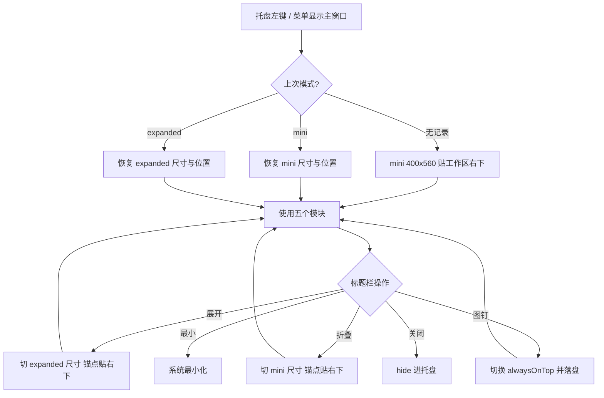

# 主窗口 Mini 双模式优化 · 需求分析

- **需求名称**：主窗口 Mini 双模式（默认小窗 + 一键展开）
- **需求来源**：开发者
- **关联 PRD / UI**：`DESIGN.md`、`docs/02_功能设计/主窗口Mini双模式_优化方案_20260916.md`
- **优先级**：P0
- **状态**：已开发
- **版本**：v0.1
- **创建日期**：2026-09-16
- **最后更新**：2026-09-16

---

## 1. 业务背景

凌台 Loft 定位是「驻留桌面的轻量控制台」。当前主窗口默认 **1180×760**、最小 **920×600**，加上 38px 自绘标题栏和 76px 左侧导航，打开后约占一块 1080p 屏幕的 **55% 面积**，把 IDE / 浏览器挤到一边。

产品原则里写着「低占用」，但主界面仍按「完整工作台」在做。用户日常路径是：托盘点一下 → 启动一两个应用 / 看一眼端口 → 关掉。这个路径不需要一张书桌那么大的窗。

不做的后果：用户宁愿把它关进托盘，工具变成「想起来才打开的后台程序」，驻留价值下降。

做完的预期：默认打开是贴在右下角的 400×560 面板（约占 1080p 的 11%），需要看监控大图或改设置时再展开到约 980×680。关窗仍进托盘。HUD 条保持独立，不并进主窗。

### 优化前可量化指标

| 指标 | 现状 |
|---|---|
| 主窗口默认逻辑尺寸 | 1180 × 760 |
| 主窗口最小尺寸 | 920 × 600 |
| 相对 1920×1080 面积占比 | ≈ 43%（未计任务栏） |
| 壳层固定占用 | 标题栏 38px + 侧栏 76px |
| 打开位置 | 屏幕居中 |
| 置顶 | 无 |
| 尺寸/位置记忆 | 无 |

### 优化后预期指标

| 指标 | 目标 |
|---|---|
| mini 默认尺寸 | 400 × 560（约占 1920×1080 的 11%） |
| mini 最小尺寸 | 360 × 440 |
| expanded 尺寸 | 980 × 680（比现状略收，仍能看监控） |
| expanded 最小尺寸 | 760 × 520 |
| 首次打开位置 | 工作区右下，边距 12px |
| 置顶 | 标题栏图钉，默认关，状态持久化 |
| 模式记忆 | 记住上次是 mini 还是 expanded，以及各自位置 |

---

## 2. 目标与非目标

### 目标

- 默认以 mini 面板打开，对主工作区几乎无遮挡。
- 同一套五个模块（启动器 / 资源 / 监控 / 端口 / 设置）在 mini 与 expanded 都能用，不拆成两个产品。
- 一键在两种窗体尺寸之间切换，切换时右下角锚点尽量保持，避免窗体「跳到屏幕中间」。
- 可选置顶；关闭仍隐藏到托盘；HUD 行为不变。
- 记住模式、置顶、两个模式下各自的位置。

### 非目标

- 本次不做「悬浮启动坞 / dock」形态。
- 本次不改 HUD 尺寸、位置、指标内容。
- 本次不改启动/扫描/杀进程等业务逻辑，不改 JSON 业务字段语义。
- 本次不新做全局热键、开机自启（已有的不动）。
- 本次不重做主题系统、不换图标集。
- 本次不把主窗口改成点击外部自动隐藏（避免误关）。

---

## 3. 用户与场景

### 用户角色

| 角色 | 描述 | 权限 |
|---|---|---|
| 本机使用者 | 唯一用户，Windows 桌面 | 全部操作 |

### 核心使用场景

1. **随手启动**
   - 触发：托盘左键 / 「显示主窗口」
   - 流程：右下角弹出 400×560 面板 → 点图标启动 → 点 × 隐藏到托盘
   - 结果：应用已启动，屏幕中央的 IDE 几乎没被挡住
2. **看一眼端口 / 性能**
   - 触发：mini 顶栏点「端口」或「监控」
   - 流程：仍在小窗内浏览；表格可横向滚动；不够看再点「展开」
   - 结果：不离开当前工作流也能扫一眼
3. **需要大屏操作**
   - 触发：点标题栏「展开」
   - 流程：窗体长到 980×680，侧栏+完整页头恢复；再点「折叠」回到 mini
   - 结果：添加应用、看多卡监控时不憋屈
4. **钉在桌面上**
   - 触发：点图钉
   - 流程：alwaysOnTop on；再点取消
   - 结果：写代码时面板浮在上面，但不默认打扰别人

---

## 4. 业务流程



---

## 5. 数据模型（业务视角）

在现有 `config.json` 增加 `ui` 段，缺省等于「第一次用」：

```json
{
  "ui": {
    "windowMode": "mini",
    "alwaysOnTop": false,
    "mini": { "x": null, "y": null, "w": 400, "h": 560 },
    "expanded": { "x": null, "y": null, "w": 980, "h": 680 }
  }
}
```

- `windowMode`：`mini` | `expanded`
- `x/y` 为逻辑像素，相对虚拟桌面；`null` 表示尚未记忆，按「工作区右下 + 12px」计算
- 老配置没有 `ui` 时走默认，不迁移、不报错

---

## 6. 功能清单（含边界）

| 功能点 | 规则 | 边界 / 异常 |
|---|---|---|
| 默认 mini | 新用户 / 无 ui 字段 → mini | 老用户同样默认 mini（本次就是为了变小） |
| 展开 / 折叠 | 标题栏按钮；expanded 时按钮文案变为「折叠」 | 切换中禁止最大化状态残留 |
| 置顶 | 图钉，默认关 | 失败只打日志，UI 回到实际状态 |
| 位置 | 首次右下；之后记住 | 显示器热插拔后若位置越界，重新贴当前工作区右下 |
| 尺寸 | 用户可拖边改大小，写入对应模式 | 不超过最小/最大；最大不超过工作区 |
| mini 导航 | 顶栏图标 Tab，无左侧栏 | 文字用 tooltip |
| expanded 导航 | 保持现有 76px 侧栏 | 与现状一致 |
| 弹层 | mini 下添加应用等改为贴窗 sheet | 不允许 720px 对话框撑破 400px 窗 |
| HUD | 不动 | — |

---

## 7. 权限与安全

单机本地应用，无多用户权限模型。置顶 / 改窗体尺寸使用 Tauri window API，需补齐 capability：`set-size`、`set-min-size`、`set-max-size`、`set-always-on-top`、`outer-position`、`available-monitors`。不新增网络、不提升进程权限。

---

## 8. 非功能

- 模式切换（改尺寸 + 改位置）应在 200ms 内完成，无闪白、无二次跳动。
- 配置写入失败不影响当次会话的窗口行为，下次启动回退默认 mini。
- 不增加空闲 CPU / 内存预算（不新开窗口、不加轮询）。

---

## 9. 验收标准

- [ ] 冷启动主窗口为 400×560（允许 ±2px 舍入），位于主屏工作区右下，距边 ≥ 8px，不被任务栏挡住。
- [ ] 点「展开」变为约 980×680，右下角仍贴在原区域；侧栏出现；最大化按钮可用。
- [ ] 点「折叠」回到 mini，最大化按钮消失；若当时是最大化，先还原再缩。
- [ ] 图钉开启后，切换到其它应用 Loft 仍在最前；关闭图钉后可被挡住。
- [ ] 关掉再从托盘打开，模式 / 置顶 / 位置与上次一致。
- [ ] mini 下五个页面都能完成主路径：启动应用、打开资源、看 CPU、看端口、改主题。
- [ ] mini 下打开「添加应用」，对话框不溢出窗口。
- [ ] HUD 尺寸、右上角定位、右键隐藏行为与现在一致。
- [ ] 关闭按钮仍是 hide 到托盘，不是退出。

---

## 10. 待确认

以下已在对话中确认，写入方案后视为冻结：

1. 形态：双模式 mini + 展开 —— **已确认**
2. 置顶：可置顶，默认关 —— **已确认**
3. 位置：右下角 —— **已确认**

方案阶段补充约定（若反对请在确认前改）：

4. mini 默认 400×560，不是更窄的 320 宽（启动器一排至少 4 个图标）。
5. 老用户也默认进 mini，不沿用 1180×760。
6. 展开后仍可最大化；mini 禁止最大化。
7. 不引入「失焦自动隐藏」。
