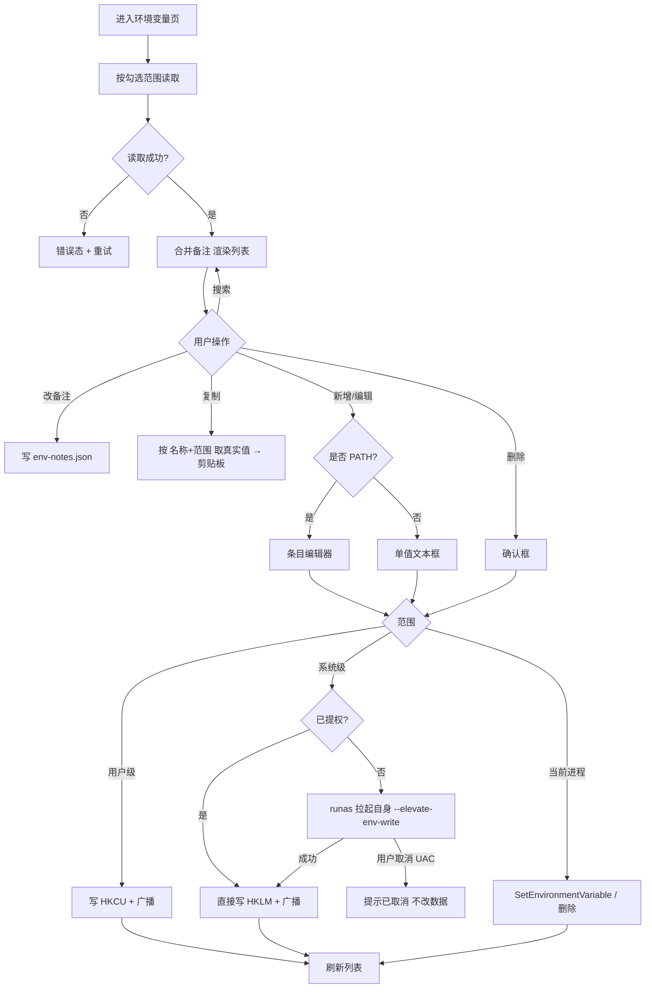

# 环境变量查看与编辑 · 需求分析

- **需求名称**：环境变量板块（查看 / 备注 / 复制 / 增删改）
- **需求来源**：开发者
- **关联 PRD / UI**：无独立设计稿，交互对齐现有「端口监控」列表页
- **优先级**：P1
- **状态**：已开发
- **版本**：v0.1
- **创建日期**：2026-09-16
- **最后更新**：2026-09-16

---

## 1. 业务背景

开发者日常要查 `JAVA_HOME`、`PATH`、代理、Token 这类环境变量：现在只能打开「系统属性 → 环境变量」，或在终端里 `echo %VAR%`。凌台已经聚合了启动器、资源、端口、性能，缺一块「本机环境」。

不做的后果：用户为了复制一个变量值仍要跳出凌台；备注（「这是公司 JDK 17」「这是代理」）无处可放。

做完的预期：左侧导航多一个「环境变量」板块。列表默认不展示值（避免肩窥密钥），名称 + 备注一目了然，一键复制真实值；用户 / 系统 / 当前进程三档可切换；可以新增、修改、删除真实环境变量；`PATH` 按条目拆开编辑。

---

## 2. 目标与非目标

### 目标

- 列出 Windows 用户级、系统级、当前进程三档环境变量，可多选过滤，默认勾选「用户 + 系统」。
- 列表只显示 **名称** 和 **备注**；范围用徽章标在名称旁。
- 备注由用户自由编辑，落在凌台本地，不写进 Windows。
- 一键把该变量在对应范围下的真实值写入剪贴板。
- 支持对用户级 / 系统级 / 当前进程 新增、修改、删除真实环境变量。
- 系统级写入自动拉起 UAC；用户取消提权时明确提示，不静默失败。
- `PATH` / `Path` 编辑时拆成条目列表（增删排序），保存时按 `;` 拼回。
- 写入用户 / 系统后广播 `WM_SETTINGCHANGE`，让资源管理器等已打开程序尽量刷新。

### 非目标

- 本次不做 macOS / Linux 的用户级 / 系统级读写（这两档在非 Windows 上入口隐藏或提示不支持；进程档仍可用）。
- 本次不做环境变量「配置方案 / profile」切换（如 dev / prod 整套导入导出）。
- 本次不修改「用凌台启动的第三方程序」的继承环境（启动器仍走系统 shell；进程档只影响凌台自己）。
- 本次不做云同步、多用户备注共享。
- 本次不解析 / 展开 `%VAR%` 嵌套引用做依赖图。
- 本次不在列表里展示变量值（含打码预览也不做）。

---

## 3. 用户与场景

### 用户角色

| 角色 | 描述 | 权限 |
|---|---|---|
| 本机使用者 | 凌台唯一用户 | 读写用户级 / 进程级；系统级需 UAC 同意 |
| 管理员身份运行时的同一用户 | 已提权的凌台进程 | 系统级可直接写，不再弹 UAC |

### 核心使用场景

1. **查并复制**
   - 触发：要在终端 / IDE 里贴 `JAVA_HOME`
   - 流程：打开板块 → 搜名称 → 点复制
   - 结果：剪贴板是该范围下的真实值；列表始终不显示值
2. **给变量写备注**
   - 触发：分不清两条相似的 PATH / 代理
   - 流程：在右侧备注框输入，失焦即保存
   - 结果：下次打开仍在，换机器不会跟着走（只在本机 `%APPDATA%`）
3. **改用户级变量**
   - 触发：换了 JDK 路径
   - 流程：点编辑 → 改值 → 保存 → 写 HKCU 并广播
   - 结果：新开的 cmd / 资源管理器能读到新值；凌台「当前进程」档不同步刷新（见规则）
4. **改系统级 PATH**
   - 触发：给系统 PATH 加一条
   - 流程：过滤「系统」→ 编辑 Path → 条目列表增删排序 → 保存 → UAC → 写 HKLM
   - 结果：成功后刷新列表；取消 UAC 则变量不变
5. **只改凌台自己的环境**
   - 触发：临时给凌台加一个 `HTTP_PROXY` 做调试
   - 流程：过滤「当前进程」→ 新增 / 编辑
   - 结果：只影响凌台进程，关闭后丢失；不写注册表

---

## 4. 业务流程

---

## 5. 数据模型（业务视角）

| 实体 | 关键属性 | 关系 |
|---|---|---|
| EnvVar | name, scope(user/machine/process), value（仅在详情/复制时取出）, kind(sz/expand_sz) | 同一 name 在不同 scope 是不同行 |
| EnvNote | key=`{scope}:{name}`, text | 一对一挂在 EnvVar 上，仅本地 |

无状态机。变量要么存在于某范围，要么不存在。

---

## 6. 功能清单

| 编号 | 功能 | 必做 / 可选 | 备注 |
|---|---|---|---|
| F-01 | 左侧导航新增「环境变量」 | 必做 | 放在端口与设置之间 |
| F-02 | 三档多选过滤，默认用户+系统 | 必做 | 至少勾选一档；全不选时按空态处理并提示 |
| F-03 | 列表：名称 + 范围徽章 + 备注 + 操作 | 必做 | 不展示值 |
| F-04 | 搜索名称 / 备注 | 必做 | 不按值搜索（值未下发前端） |
| F-05 | 备注失焦保存 | 必做 | 长度上限 200 |
| F-06 | 一键复制该行真实值 | 必做 | 成功有短暂「已复制」反馈 |
| F-07 | 新增 / 编辑 / 删除 用户级 | 必做 | HKCU\Environment |
| F-08 | 新增 / 编辑 / 删除 系统级（UAC） | 必做 | HKLM Session Manager\Environment |
| F-09 | 新增 / 编辑 / 删除 当前进程 | 必做 | 只影响凌台进程 |
| F-10 | PATH 条目化编辑 | 必做 | 大小写不敏感识别 Path / PATH |
| F-11 | 刷新按钮 | 必做 | 不自动轮询 |
| F-12 | 空态 / 加载态 / 错误态 | 必做 | |
| F-13 | 删除 Path / ComSpec 等关键名二次确认 | 必做 | 文案点名风险 |
| F-14 | 非 Windows 降级 | 必做 | 仅进程档 |

---

## 7. 业务规则

### 7.1 校验规则

- 变量名：必填，1–255 字符，不能含 `=`、NUL、换行；首尾空白剔除。
- 变量值：允许空字符串（Windows 允许）；长度上限 32 767（Windows 环境块限制）。
- 备注：可选，最长 200 字符，超出前端截断并提示。
- 同范围重名：新增时若已存在，编辑框按「覆盖」处理，保存前确认「将覆盖已有 {name}」。
- PATH 条目：空行丢弃；允许重复条目（Windows 本身允许，不擅自去重）。

### 7.2 计算规则

- 列表排序：按名称不区分大小写，同名按 用户 → 系统 → 进程。
- PATH 拆分：按 `;` 切，保留每段原样（含未展开的 `%SystemRoot%`）。
- PATH 写回：条目用 `;` 拼接；值含 `%` 时用 `REG_EXPAND_SZ`，否则 `REG_SZ`。其它变量同样：含 `%xx%` 形态则 `REG_EXPAND_SZ`。
- 读取注册表时 **不展开** 环境引用，编辑看到的是存储原值。复制时同样复制原值（与系统对话框「编辑文本」一致），不复制展开后的值。

### 7.3 权限规则

- 用户级、进程级：普通权限即可。
- 系统级：进程已提权则直接写；否则 `ShellExecuteEx(runas)` 拉起自身带 `--elevate-env-write`。UAC 拒绝 = 操作取消。
- 读取系统级：标准用户可读 HKLM 该键，不需提权。

### 7.4 生效范围

| 范围 | 持久化 | 对已打开程序 | 对凌台自己 |
|---|---|---|---|
| 用户 | HKCU，长期 | 广播后部分程序刷新；多数需重开 | **不**自动改凌台进程环境块 |
| 系统 | HKLM，长期 | 同上 | 同上 |
| 进程 | 无 | 无 | 立即生效，退出即丢 |

页面副标题写明这条，避免用户以为改了用户变量后凌台「当前进程」列表会马上变。

---

## 8. 验收标准

- [ ] 侧栏能进入「环境变量」，标题为「环境变量」
- [ ] 默认勾选用户+系统；进程未勾选；列表能看到 HKCU / HKLM 中的变量名
- [ ] 列表任何单元格都不渲染变量值
- [ ] 给 `JAVA_HOME`（若存在）写备注「JDK」，重启凌台后备注仍在
- [ ] 点复制，记事本能粘贴出与注册表一致的原值
- [ ] 新增用户级 `LOFT_TEST=hello`，系统属性对话框能看到；删除后消失
- [ ] 未提权时改系统级弹出 UAC；点取消后变量不变且有「已取消提权」提示
- [ ] 编辑系统 Path：增加一条临时目录，保存（同意 UAC）后系统 Path 含该条目
- [ ] 进程档新增 `LOFT_PROC=1`，刷新后进程列表能看到；重启凌台后消失
- [ ] 删除 `Path` 会弹出点名风险的二次确认，取消则不删
- [ ] 搜索「java」能筛到名称或备注含 java 的行
- [ ] 读取失败时出现错误条 + 重试，不白屏

---

## 9. 边界条件 / 异常路径

| 场景 | 行为 |
|---|---|
| 空列表 | 空态文案「当前过滤条件下没有环境变量」 |
| 加载中 | 表体骨架/「正在读取…」，操作按钮 disable |
| 注册表读取失败 | 错误条 + 重试 |
| UAC 取消 | toast/错误条「已取消提权」，数据不变 |
| 提权进程写入失败 | 返回具体错误（拒绝访问 / 名称非法） |
| 超长备注 | 输入到 200 停止，提示已达上限 |
| 变量名含 `=` | 保存时前端拦截 |
| 同范围重名新增 | 确认覆盖 |
| PATH 全删成空 | 允许，但二次确认「将把 Path 写成空」 |
| 剪贴板失败 | 提示「复制失败」 |
| 非 Windows | 用户/系统开关 disable，只留进程档 |

---

## 10. 关联影响

### 受影响的现有功能

- 侧栏导航：多一项，高度仍放得下，需回归 mini 窗（若已落地）下标签是否被裁切
- 启动器 / 资源：不改启动时的环境继承
- 设置页数据目录说明：多一个 `env-notes.json`

### 依赖的现有功能

- 端口页的表格、PageHeader、确认弹窗、ContextMenu 模式可复用视觉
- `settings.rs` 的 config_dir 读写 JSON 模式

### 配置变更

- 无新字典、无新权限模型（单机应用）

---

## 11. UI / 交互

- 主要页面：环境变量列表页
- 关键交互：
  - 顶栏：搜索、三档 chip、刷新、新增
  - 行：名称（等宽）+ 范围徽章 | 备注 inline input | 复制 / 编辑 / 删除图标
  - 右键：复制值、复制名称、编辑、删除
  - 编辑弹窗：名称、范围、值（或 PATH 条目列表）、备注
- 设计稿：无，对齐 PortsView 表格密度与主题变量

---

## 12. 测试视角评审记录

- [x] 验收用例可直接转为测试步骤
- [x] 边界条件明确（空 PATH、UAC 取消、重名覆盖）
- [x] 异常路径覆盖
- [x] 可观测性：提权失败 / 注册表失败有面向用户的错误串
- [x] 可回放：用一次性 `LOFT_TEST` 变量，测完删除

发现的问题：无阻塞。进程档与用户档同名时列表会出现两行，属预期，需在副标题写清。

---

## 13. 待确认事项

以下已在对话中确认，列入冻结候选：

- [x] 三档可切换，默认用户+系统
- [x] 列表不展示值
- [x] 支持真实增删改
- [x] 进程档可改（仅凌台进程）
- [x] 系统级自动 UAC
- [x] PATH 条目化编辑

残留默认（若反对请在确认方案时指出）：

- [ ] 复制的是注册表**未展开**原值，不是展开后的路径
- [ ] 改用户/系统后**不**回写凌台当前进程环境块
- [ ] 备注按 `{scope}:{name}` 为键，同名不同范围备注互相独立
- [ ] 关键名删除二次确认名单：`Path`、`PATHEXT`、`ComSpec`、`OS`、`windir`、`SystemRoot`、`TEMP`、`TMP`、`USERNAME`、`USERPROFILE`、`SystemDrive`

---

## 14. 变更记录

| 日期 | 版本 | 变更内容 | 操作人 |
|---|---|---|---|
| 2026-09-16 | v0.1 | 初稿 | AI |
