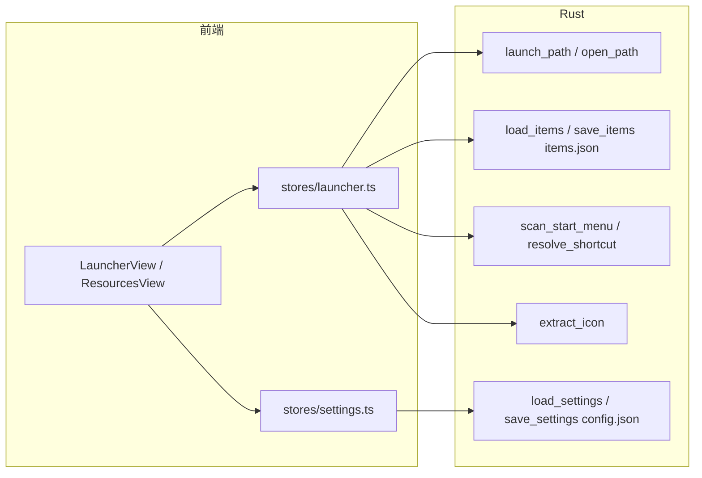

# 元信息

- **需求名称**：启动项/资源路径双写（绝对+相对）与失效回退修复
- **需求来源**：开发者
- **关联 PRD / UI**：无
- **优先级**：P1
- **状态**：已冻结（方案已确认并实施）
- **版本**：v0.1
- **创建日期**：2026-09-17
- **最后更新**：2026-09-17

---

## 1. 业务背景

凌台 Loft 的启动项（`LauncherItem`）与资源（`ResourceItem`）目前**只保存一条绝对路径** `path`：

- 拖入文件 / 从开始菜单扫描 / 手动添加，落盘均为绝对路径（如 `D:\Portable\Apps\Foo\Foo.exe`、`C:\ProgramData\...\Foo.lnk`）。
- 点击启动/打开时直接 `launch_path` / `open_path`，**路径不存在时只会报「启动失败」**，无回退、无修复入口。

痛点：

1. **盘符变更 / 移动硬盘 / 同步盘换机**后，同一软件在本机的新位置可能是 `E:\Portable\Apps\Foo\Foo.exe`，旧绝对路径失效，条目全部变砖。
2. **用户目录迁移**（重装、换用户名）导致自定义工具路径失效。
3. 失效后只能删除重加，已整理的分组、排序、名称、图标缓存一并丢失。

做了之后的预期收益：

- 条目在绝对路径之外冗余一份**相对「路径根目录」的相对路径**；绝对失效时可用相对路径拼出可用位置并启动。
- 相对可用、绝对失效时，可**询问是否修复**；设置中提供**自动修复**开关。
- 列表加载时批量健康检查，卡片可标识失效/可恢复，避免「点了才知道坏了」。

---

## 2. 目标与非目标

### 目标

| ID | 目标 | 成功标准 |
|---|---|---|
| F-01 | 配置一个或多个**路径根目录** | 设置页可增删改根目录列表，持久化到 `config.json` |
| F-02 | 添加/导入条目时，若路径位于某根之下，同时写入 `relPath`（+根提示） | 根下新条目落盘含 `relPath`；不在任何根下时 `relPath=null`，行为与现状一致 |
| F-03 | 启动/打开时：绝对可用则用绝对；绝对失效则用「根 + 相对」回退 | 回退成功能正常启动；两者皆失效时明确报错 |
| F-04 | 相对可用、绝对失效时的修复策略 | 默认弹确认；设置开启「自动修复路径」后静默写回新绝对路径 |
| F-05 | 应用启动/进入启动器或资源页时，异步批量检测路径健康状态 | 卡片展示失效/可恢复状态；可恢复项提供「修复」操作 |
| F-06 | 对既有数据兼容 | 旧 `items.json` 无新字段可正常加载；可选「回填相对路径」 |

### 非目标（明确不做）

- 不做多机实时同步、不做路径变更的文件系统监听（`ReadDirectoryChanges`）。
- 不做「按文件名全局搜索定位」的智能重定位（只走「已配置根 + 相对路径」）。
- 不迁移/备份体系（见 `20260918_数据备份与设备恢复需求分析.md`，二者独立）。
- 不改变开始菜单扫描逻辑本身（扫描结果在加入分组时才计算相对路径）。
- 网址类资源（`kind=url`）不参与路径检测与回退。
- 不自动改写与主路径无关的展示缓存语义（见 §5 图标与 target）。

---

## 3. 用户与场景

### 用户角色

| 角色 | 描述 | 权限 |
|---|---|---|
| 桌面用户 | Loft 唯一使用者 | 配置根目录、开关自动修复、修复/忽略失效项 |

### 核心使用场景

1. **场景 1：配置路径根目录**
   - 触发：设置 → 启动器/路径 → 添加根（如 `D:\Portable`、`C:\Users\me\Tools`）
   - 结果：`config.json` 的 `launcher.pathRoots` 更新

2. **场景 2：在根下添加启动项/资源**
   - 触发：拖入 `D:\Portable\Apps\Foo\Foo.exe`
   - 结果：`path=D:\Portable\Apps\Foo\Foo.exe`，`relPath=Apps\Foo\Foo.exe`，`rootHint=D:\Portable`

3. **场景 3：换盘符后启动**
   - 触发：原盘现为 `E:\Portable\...`，用户点击启动
   - 流程：绝对路径不存在 → 用 `rootHint`/各根 + `relPath` 尝试 → 找到 `E:\Portable\Apps\Foo\Foo.exe` → 启动
   - 结果：启动成功；若未开自动修复则询问「是否将绝对路径修复为 E:\...」；开启则静默写回

4. **场景 4：批量发现失效**
   - 触发：应用启动或进入启动器/资源页
   - 结果：异步检测；失效项角标「路径失效」，可恢复项显示「可恢复」+「修复」按钮

5. **场景 5：图标/target 与主路径分离（.lnk）**
   - 触发：条目 path 指向 `.lnk`，`target`/`iconPath` 由解析得到
   - 结果：**只修复 `path`**；修复成功后重新 `resolve_shortcut` 刷新 `target`/`iconPath`；**不**因 path 修复去改写已缓存的 `iconData` 内容（可选提供「刷新图标」既有操作）

---

## 4. 现状分析（摘要）

### 4.1 数据与调用链

### 4.2 字段现状

| 实体 | 路径相关字段 | 说明 |
|---|---|---|
| `LauncherItem` | `path`, `target?`, `iconPath?`, `iconData?` | `path` 为启动入口；后三者为展示/解析附属 |
| `ResourceItem` | `path`, `kind` | `kind=file\|folder` 走文件系统；`url` 走浏览器 |
| `AppSettings.launcher` | `autoScan`, `extraPaths` | 无根目录、无自动修复 |
| 持久化 | `items.json` v3 | 无 `relPath` |
| 启动 | `launch_path(path)` | 无存在性检查、无回退 |

### 4.3 调用方清单（涉及 path 的写入点）

| 写入点 | 位置 | 现行为 |
|---|---|---|
| 拖入启动器 | `LauncherView.vue` → `addItem` | 仅存拖入绝对路径 |
| 从扫描添加 | `addItemsFromShortcuts` | 存 `.lnk` 绝对路径 + target/icon |
| 拖入资源 / 手动添加 | `ResourcesView.vue` → `addResource` | 仅存绝对路径 |
| 迁移 v1→v3 | `launcher.ts` `migrate` | 原样保留 `path` |

### 4.4 现有兜底

- `extract_icon` 失败静默。
- `launch_path` 失败返回字符串错误，前端一般 `catch` 后提示或忽略。
- **无**路径存在性预检、**无**相对回退。

---

## 5. 关键约束（图标 / target 防误修）

开发者已明确：启动项与资源默认都支持双路径，但**图标等附属字段与主路径分离时，不能「用启动修复逻辑」连带改错**。

设计约束：

1. **修复对象仅限主路径**：`LauncherItem.path`、`ResourceItem.path`。
2. **不把 `iconPath` / `iconData` / `target` 当作可回退的启动入口**。
3. `.lnk` 的 `target`/`iconPath` 仅在 `path` 修复成功且原文件为 `.lnk` 时，通过既有 `resolve_shortcut` **重新解析**得到，禁止手工拼接。
4. `iconData`（base64 缓存）在路径修复时**默认保留**；用户可点「刷新图标」覆盖。
5. 若某附属字段指向的路径失效而主路径正常：**本次不处理**（记入问题记录可选后续），避免范围蔓延。

---

## 6. 业务规则（待方案细化，已与开发者对齐的方向）

| 规则 | 内容 |
|---|---|
| R-01 | 相对路径基准 = 设置中的**路径根目录列表**（可多个） |
| R-02 | 计算相对路径时，仅当绝对路径是某根的子路径（Windows 大小写不敏感比较）才写入 `relPath`；含 `..` 的相对结果拒绝写入 |
| R-03 | 启动优先级：`path` 可用 → 用之；否则 `rootHint+relPath`；否则按 `pathRoots` 顺序尝试 `root+relPath`；均失败则报错 |
| R-04 | 相对可用、绝对失效：默认询问修复；`launcher.autoRepairPaths=true` 时自动写回并提示一次 |
| R-05 | 批量检测在应用启动/相关页面加载时异步执行，不阻塞 UI |
| R-06 | `kind=url` 跳过检测与回退 |
| R-07 | 旧数据无 `relPath` 不报错；提供手动「回填相对路径」 |

---

## 7. 风险与待确认项

| 风险 | 说明 | 缓解 |
|---|---|---|
| 多根下同相对路径 | `Apps\Foo.exe` 在两个根都存在 | 优先 `rootHint`，否则按配置顺序取第一个存在的；修复前在确认框展示将写入的完整路径 |
| 根目录本身被移动 | `rootHint` 失效 | 回退时遍历全部根 |
| 批量检测 IO | 条目很多时 `exists` 棡环 | 分批/并发上限；失败项缓存，避免每帧检测 |
| 与备份需求耦合 | 未来 items 进 SQLite | 本需求仍落在 JSON 字段层，不阻塞备份方案 |

**待开发者确认（实施前）**

- [ ] 根目录是否允许 UNC（`\\server\share`）？方案默认：允许。
- [ ] 自动修复默认值：方案默认 **关闭**（先询问）。
- [ ] 回填相对路径：方案默认提供设置页按钮，不自动静默全量改写旧数据。

---

## 8. 验收标准（摘要）

1. 配置根后新添加的根下条目，`items.json` 含正确 `relPath`/`rootHint`。
2. 人为改盘符/挪目录后，绝对失效项可经相对路径启动成功。
3. 默认弹修复确认；开启自动修复后 `path` 被更新且再次启动走绝对路径。
4. 列表可见失效/可恢复状态；网址资源无检测噪音。
5. 无根、无 `relPath` 的旧条目行为与改前一致（回归）。
