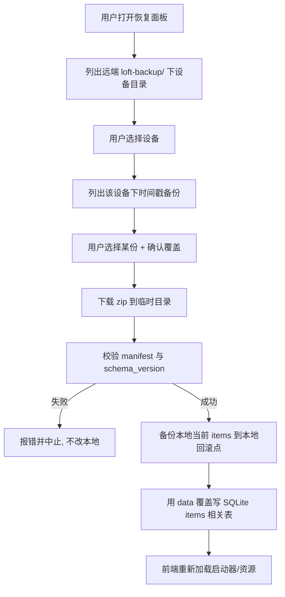
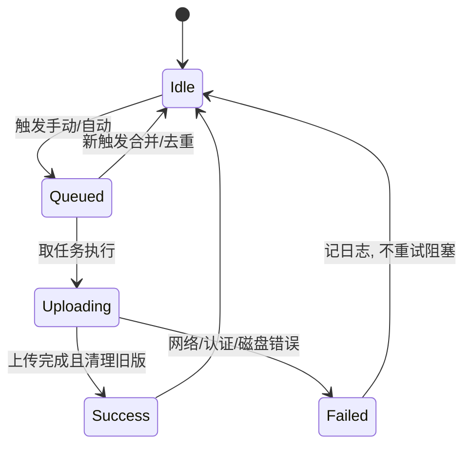

# 元信息

- **需求名称**：数据本地存储 + WebDAV/S3 按设备备份与恢复
- **需求来源**：开发者
- **关联 PRD / UI**：无
- **优先级**：P0
- **状态**：草稿
- **版本**：v0.1
- **创建日期**：2026-09-18
- **最后更新**：2026-09-18

---

## 1. 业务背景

凌台 Loft 目前所有业务数据以 JSON 文件保存在 `%APPDATA%\com.loft.app\`：

| 文件 | 内容 |
|---|---|
| `items.json` | 启动项 + 资源（分组结构 v3） |
| `config.json` | 主题 / 主色 / 刷新间隔 / 窗口模式等 |
| `env-notes.json` | 环境变量备注 |

问题：

1. **换机/重装无法迁移** —— 用户在 A 机器精心整理的启动项与资源，换到 B 机器只能手工重建。
2. **无备份通道** —— 系统盘损坏或误删目录即永久丢失。
3. **多设备无法区分** —— 即便把文件拷到网盘，也分不清哪份属于哪台机器。
4. **JSON 扁平文件扩展性差** —— 后续要加备份元数据、设备信息、凭证等结构化数据时，JSON 难以约束。

做了之后的预期收益：

- 用户可在设置中配置 WebDAV 或 S3，**一键备份当前设备数据**，并**从任意已备份设备恢复**。
- 业务数据迁入 SQLite，读写更稳、可加约束，为后续功能打底。
- 凭证不落明文，符合项目安全规范。

---

## 2. 目标与非目标

### 目标

- **F-01** 业务数据（启动项/资源、设置、环境变量备注）从 JSON 迁移到本地 SQLite。
- **F-02** 用户可设置**设备 ID**（仅英文+数字，1–32 字符）与可选**设备名称**（便于识别）。
- **F-03** 支持配置 **WebDAV** 或 **S3** 作为远程备份目标（二选一生效，配置可切换）。
- **F-04** 支持**手动立即备份**，以及本地数据变更后的**防抖自动备份**。
- **F-05** 远端按 `deviceId` 隔离目录，保留最近 **N** 份时间戳备份（N 默认 5，可配置 1–20）。
- **F-06** 设置页可**列出远端各设备**及其备份列表，选择某设备的某份备份**覆盖恢复**到本机。
- **F-07** WebDAV 密码 / S3 SecretKey 使用本地加密存储，不明文写入配置。

### 非目标（明确不做）

- 不做多端实时同步 / 冲突合并（恢复语义是**整包覆盖**）。
- 不做备份文件的端到端加密上传（仅凭证本地加密）。
- 不备份 `iconData` 大图缓存以外的二进制资源本体（资源卡片只备份路径元数据）。
- 不做 macOS / Linux 的 keyring 适配（本期仅 Windows）。
- 不做云端账号体系 / 多用户。
- 不迁移监控历史、端口列表等运行时数据（本就不落盘）。

---

## 3. 用户与场景

### 用户角色

| 角色 | 描述 | 权限 |
|---|---|---|
| 桌面用户 | Loft 的唯一使用者，本机单用户 | 配置备份、备份、恢复、设置设备身份 |

### 核心使用场景

1. **场景 1：首次配置设备身份**
   - 触发：用户进入 设置 → 数据与备份
   - 流程：填写设备 ID（如 `office-pc`）→ 可选填设备名称（如「办公室主机」）→ 保存
   - 结果：本地记录 deviceId/deviceName；远端备份将写入 `.../office-pc/`

2. **场景 2：配置 WebDAV 并立即备份**
   - 触发：用户选择备份方式 WebDAV，填入 URL/用户名/密码/基础路径
   - 流程：测试连接 → 保存配置 → 点击「立即备份」
   - 结果：远端生成 `loft-backup/{deviceId}/{timestamp}.zip` + 更新 `meta.json`；保留不超过 N 份

3. **场景 3：变更后自动备份**
   - 触发：用户增删改启动项/资源，或修改设置并成功持久化
   - 流程：本地写 SQLite 成功后触发防抖（默认 30s）自动备份任务
   - 结果：远端出现新时间戳备份；失败则静默记日志，不打断用户

4. **场景 4：换机恢复**
   - 触发：新机器装好 Loft，已配置同一远程存储
   - 流程：进入 数据与备份 → 列出远端设备 → 选择 `office-pc` → 选择某时间戳备份 → 确认覆盖恢复
   - 结果：本机 SQLite 中启动项/资源被替换为备份内容；设置/备注是否覆盖见规则（默认仅恢复启动项+资源）

5. **场景 5：切换备份协议**
   - 触发：用户从 WebDAV 改为 S3
   - 流程：切换类型 → 填 S3 endpoint/region/bucket/ak/sk → 测试连接 → 保存
   - 结果：后续备份/恢复均走 S3；旧 WebDAV 配置保留但不生效

---

## 4. 业务流程

### 4.1 备份

```mermaid
flowchart TD
    A[触发: 手动/自动防抖] --> B{已配置设备ID?}
    B -- 否 --> Z1[提示先设置设备ID]
    B -- 是 --> C{已配置远程且连接可用?}
    C -- 否 --> Z2[提示检查远程配置]
    C -- 是 --> D[从 SQLite 导出 items 快照]
    D --> E[打包 zip: manifest.json + data.json]
    E --> F[上传到 {basePath}/loft-backup/{deviceId}/{ts}.zip]
    F --> G[更新 meta.json: name, lastBackupAt, count]
    G --> H{备份数量 > N?}
    H -- 是 --> I[删除最旧备份]
    H -- 否 --> J[完成]
    I --> J
```

### 4.2 按设备恢复



---

## 5. 数据模型（业务视角）

| 实体 | 关键属性 | 关系 |
|---|---|---|
| Device | deviceId(EN+digits), deviceName? | 1:1 本机身份 |
| BackupTarget | type(webdav\|s3), endpoint..., credentials | 1 个当前生效配置 |
| RemoteDevice | deviceId, deviceName?, lastBackupAt | 来自远端 meta.json |
| BackupArchive | timestamp, size, deviceId | 归属 RemoteDevice |
| LauncherGroup/Item, ResourceGroup/Item, AppSetting, EnvNote | 同现有 JSON 结构 | 迁入 SQLite |

### 状态：备份任务



---

## 6. 功能清单

| 编号 | 功能 | 必做/可选 | 备注 |
|---|---|---|---|
| F-01 | JSON → SQLite 迁移（items/config/env-notes） | 必做 | 首次启动自动迁移，保留原 JSON 作回滚 |
| F-02 | 设备 ID + 名称设置与校验 | 必做 | ID: `^[A-Za-z0-9]{1,32}$` |
| F-03 | WebDAV 目标配置 + 连接测试 | 必做 | |
| F-04 | S3 目标配置 + 连接测试 | 必做 | 兼容 S3 兼容存储（MinIO 等） |
| F-05 | 手动立即备份 | 必做 | |
| F-06 | 变更防抖自动备份 | 必做 | 默认 30s，可关 |
| F-07 | 列出远端设备与备份 | 必做 | |
| F-08 | 选择设备备份覆盖恢复 | 必做 | 恢复前本地回滚点 |
| F-09 | 备份保留 N 份 | 必做 | N=1..20，默认 5 |
| F-10 | 凭证本地加密 | 必做 | |
| F-11 | 备份/恢复操作日志 | 必做 | 本地 backup_log 表 |

---

## 7. 业务规则

### 7.1 校验规则

- **设备 ID**：必填后才能备份；仅 `[A-Za-z0-9]{1,32}`；保存后修改会改变远端路径，需提示「历史备份仍留在旧 ID 目录」。
- **设备名称**：可选，≤ 64 字符，仅作展示，可含中文。
- **WebDAV URL**：必须 `http://` 或 `https://`。
- **S3**：endpoint、region、bucket、accessKeyId、secretAccessKey 必填；path-style 可选（MinIO 常用）。
- **保留份数 N**：整数 1–20，默认 5。

### 7.2 备份内容范围

| 数据 | 是否备份到远端 |
|---|---|
| 启动项分组/条目（含 iconData 缓存） | **是** |
| 资源分组/条目 | **是** |
| 环境变量备注 | **是** |
| 应用设置（主题/刷新/窗口） | **是**（便于整机还原；恢复时可选是否应用） |
| 远程凭证本身 | **否**（换机需重新配置远程） |

### 7.3 恢复语义

- 默认恢复包 = 启动项 + 资源 + 环境变量备注 + 应用设置。
- 恢复前在本机生成 `rollback-YYYYmmdd-HHMMSS` 快照（本地目录），保留最近 3 个。
- 恢复后强制刷新前端相关 store。
- **deviceId 不会被恢复覆盖**（恢复不改变本机身份）。

### 7.4 自动备份触发

- 仅当：已配置 deviceId + 有效远程配置 + 自动备份开关开启。
- 防抖窗口 30s；窗口内多次变更合并为一次。
- 备份进行中再触发则排队去重为 1 次。
- 失败不自动无限重试；下一次变更或手动再试。

---

## 8. 验收标准

- [ ] 全新安装无 JSON 时，SQLite 自动建表，启动器/资源/设置可正常使用。
- [ ] 存在旧 JSON 时，首次启动完成迁移，界面数据与迁移前一致；`items.json` 等仍保留。
- [ ] 设备 ID 输入中文/符号被拒绝并提示；合法 ID 保存成功。
- [ ] 配置 WebDAV 后「测试连接」成功；错误密码时给出明确错误。
- [ ] 配置 S3（含 path-style MinIO）后「测试连接」成功。
- [ ] 点击立即备份后，远端 `loft-backup/{deviceId}/` 出现时间戳 zip 与 meta.json。
- [ ] 连续备份超过 N 次后，最旧文件被删除，数量 ≤ N。
- [ ] 修改启动项后等待防抖窗口，自动出现新备份。
- [ ] 远端存在两台设备目录时，UI 列出两台；选择 A 设备备份恢复后，本机启动项变为 A 的内容。
- [ ] 恢复失败（损坏 zip）时本机数据不变，并有错误提示。
- [ ] 配置文件/DB 中不出现明文 SecretKey/密码。

---

## 9. 边界条件 / 异常路径

| 场景 | 行为 |
|---|---|
| 未设置设备 ID 点备份 | 提示先设置设备 ID，不发起网络请求 |
| 远程配置不完整 | 按钮禁用或点击后字段级校验 |
| 网络超时 | 明确超时错误，不崩 UI；自动备份记失败日志 |
| 401/403 认证失败 | 提示检查账号密码/权限 |
| 远端目录不存在 | WebDAV 自动 MKCOL；S3 按前缀列表（无需建桶） |
| 备份 zip 空/损坏 | 恢复中止，本地不动 |
| schema_version 不认识 | 拒绝恢复并提示升级应用 |
| 磁盘满 / 无写权限 | 明确 IO 错误 |
| 恢复到本机时设备 ID 相同 | 允许（同设备重装场景） |
| 两台设备同时备份同一 ID | 后写覆盖时间戳文件，meta 以最后写入为准（不分布式锁） |
| 用户中途改 deviceId | 提示旧备份路径；新备份写入新 ID 目录 |

---

## 10. 关联影响

### 受影响的现有功能

- **启动器 store / 资源 store**：读写路径从 `load_items`/`save_items`（JSON）改为 SQLite 命令；需回归添加/编辑/删除/分组/拖拽排序。
- **设置 store**：`load_settings`/`save_settings` 走 SQLite。
- **环境变量备注**：`load_env_notes`/`save_env_notes` 走 SQLite。
- **设置页 UI**：新增「数据与备份」区块。

### 依赖

- Rust: `rusqlite`、`reqwest`、`zip`、加密库（如 `aes-gcm`）、可选 `rust-s3` 或手写 SigV4。
- 不引入服务端。

### 配置变更

- 无菜单/角色体系；不涉及权限点字典。

---

## 11. UI / 交互

设置页新增区块「数据与备份」：

1. **本机身份**：设备 ID、设备名称、保存
2. **备份目标**：类型 Tab（WebDAV / S3）+ 对应表单 + 测试连接 + 保存
3. **备份策略**：自动备份开关、防抖说明、保留份数
4. **操作**：立即备份、打开恢复面板
5. **恢复面板**：设备列表 → 备份时间列表 → 确认覆盖对话框
6. **状态条**：上次备份时间、上次错误

---

## 12. 测试视角评审记录

- [x] 验收用例可直接转为测试步骤
- [x] 边界条件明确
- [x] 异常路径覆盖
- [x] 可观测性就绪（backup_log + diag log）
- [x] 可回放性具备（本地 rollback 快照）

---

## 13. 待确认事项

- [x] 备份范围：items + env-notes + settings（不含远程凭证）
- [x] 触发：手动 + 变更防抖自动
- [x] SQLite：业务数据整体迁入
- [x] 恢复：按设备选择，整包覆盖，可选是否含 settings
- [x] 协议：WebDAV + S3 同期
- [x] 版本：保留最近 N 份

---

## 14. 变更记录

| 日期 | 版本 | 变更内容 | 操作人 |
|---|---|---|---|
| 2026-09-18 | v0.1 | 初稿 | AI |
