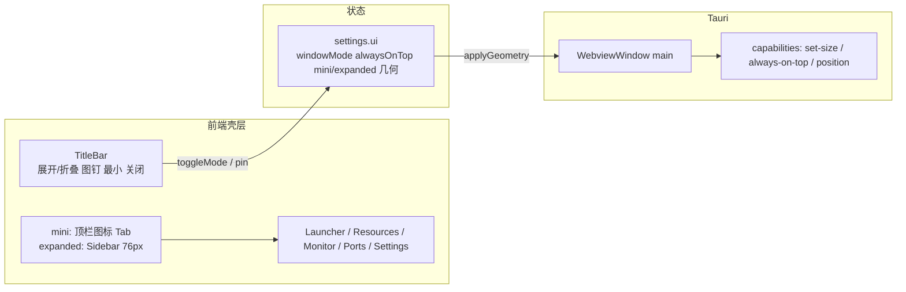
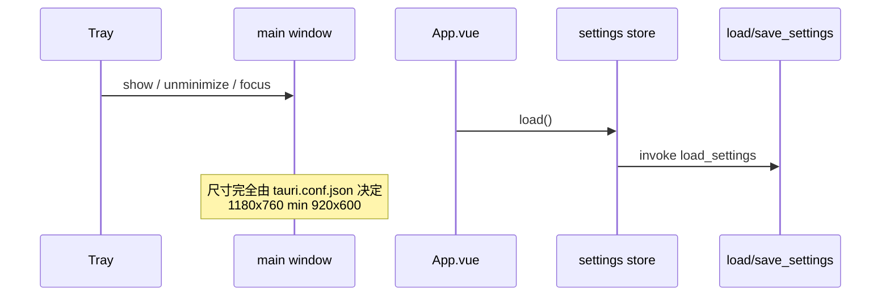

# 主窗口 Mini 双模式 · 优化方案

- **功能名称**：主窗口 Mini 双模式
- **关联需求**：`docs/01_需求分析/20260916_主窗口Mini双模式优化需求分析.md`
- **类型**：优化升级（体验 / 窗体几何）+ 有限壳层重构
- **预估工作量**：1 个开发会话
- **版本**：v0.1
- **状态**：已实施
- **创建日期**：2026-09-16
- **作者**：AI

---

## 1. 方案概述

把主窗口从「居中大控制台」改成「默认右下角 mini 面板，一键展开成完整控制台」。壳层（标题栏、导航、密度）按 `data-ui-mode` 分两套布局；五个业务 View 不拆文件，用 CSS 覆盖在窄宽度下收紧。窗口模式、置顶、位置写入现有 `config.json` 的 `ui` 字段。Rust 业务命令不动。

---

## 2. 整体架构

---

## 1.1 优化目标与预期效果

| 项 | 前 | 后 |
|---|---|---|
| 默认窗口 | 1180×760 居中 | 400×560 工作区右下 |
| 占 1080p 面积 | ~43% | mini ~11%；展开 ~32% |
| 导航 | 左栏 76px 常驻 | mini 顶栏图标；展开恢复左栏 |
| 置顶 | 无 | 图钉，默认关 |
| 记忆 | 无 | 模式 + 置顶 + 两套位置 |

成功标准见需求文档 §9。

---

## 1.2 现状问题分析

### 调用链 / 数据流

### 本模块被谁调用

| 符号 | 调用方 |
|---|---|
| `tauri.conf.json` windows[label=main] | 启动时创建主窗 |
| `show_main_window` (`src-tauri/src/lib.rs`) | 托盘菜单、托盘左键 |
| `TitleBar.vue` minimize / toggleMax / hide | 标题栏三键 |
| `getCurrentWindow()` | App.vue、HudView、TitleBar |
| `load_settings` / `save_settings` | `src/stores/settings.ts` |
| `Sidebar.vue` | `App.vue` 常驻 |
| 五 View | vue-router |

### 本模块调用了谁

- `@tauri-apps/api/window`：minimize / maximize / hide / startDragging / outerSize / setPosition（仅 HUD 用）
- 主窗目前 **没有** `setSize` / `setAlwaysOnTop` / 位置记忆
- capabilities 已有 hide/show/position/monitor，**缺** `allow-set-size`、`allow-set-min-size`、`allow-set-always-on-top`、`allow-outer-position`、`allow-available-monitors`

### 已有测试

仓库无前端单测 / E2E。回归依赖手工清单（本方案末尾补）。

### 现有兜底

- 标题栏关闭：`hide()`，失败才 `close()`
- OS 关闭：Rust `CloseRequested` 拦截后 hide
- settings 读失败：前端 DEFAULTS

---

## 3. 数据库设计

无数据库。持久化仍是 `%APPDATA%\com.loft.app\config.json`。

### 3.5 现状分析

`AppSettings` 现有字段：`version, theme, accent, ports, monitor, launcher`。Rust `load_settings` 按 JSON Value 原样读写，**多出来的字段会被保存、不会被 Rust 丢掉**。前端 `Object.assign(DEFAULTS, cfg)` 会吃掉未知字段，只要 DEFAULTS 补上 `ui` 即可兼容老文件。

---

## 4. 接口设计

不新增 HTTP。窗口几何全部走 Tauri 2 Window API（前端直接调，不包一层 Rust command，避免来回序列化）：

| API | 用途 |
|---|---|
| `getCurrentWindow().setSize(LogicalSize)` | 切模式 / 应用记忆尺寸 |
| `setMinSize` / `setMaxSize` | mini 禁最大化；展开放开 |
| `setPosition(LogicalPosition)` | 贴右下 / 恢复记忆 |
| `outerPosition` / `outerSize` / `innerSize` | 保存前读取 |
| `setAlwaysOnTop` | 图钉 |
| `isMaximized` / `unmaximize` | 切 mini 前必须还原 |
| `currentMonitor()` / `availableMonitors()` | 工作区右下、越界校正 |

`save_settings` 入参多一个 `ui` 对象，Rust 无需改签名。

---

## 5. 后端实现

### 5.1 涉及模块

- `src-tauri/tauri.conf.json`：主窗默认改为 400×560，minWidth/Height 降到 360×440，`center: false`（位置由前端放置，避免先居中再跳）。
- `src-tauri/capabilities/default.json`：补窗口权限。
- Rust `commands/settings.rs`：`default_settings()` 可加 `ui` 默认值（可选，前端 DEFAULTS 已兜底）。
- **不改** launcher / monitor / ports / tray / HUD 窗口配置。

### 5.2 关键规则

1. 启动瞬间窗口可能在 (0,0) 闪一帧：`visible` 保持 true（托盘逻辑依赖），前端 `onMounted` 尽快 `applyGeometry`。若闪动明显，再把 main 的 `visible` 改为 false，由前端 apply 完再 `show()`——作为实现时的备选，需同步改 `show_main_window`（已 show 的窗不受影响）。
2. 不在 Rust setup 里写死右下角，显示器缩放 / 任务栏由前端 `monitor.workArea` 计算更准。

### 5.3 事务与并发

配置写入无事务。切模式时顺序：若 maximized → unmaximize → setMinSize → setSize → setPosition → persist。persist 失败只 `console.error`。

---

## 6. 前端实现

### 6.1 壳层

**新增** `src/composables/useWindowMode.ts`：

- 常量 `MINI = { w:400, h:560, minW:360, minH:440 }`，`EXPANDED = { w:980, h:680, minW:760, minH:520 }`
- `applyGeometry(mode)`：读 `settings.ui[mode]`，无效则 `placeBottomRight(w,h)`
- `placeBottomRight`：`currentMonitor().workArea` 右下减 12px 边距
- `clampToWorkArea`：保存前 / 启动时，若 x/y 落在所有 monitor 之外则重贴
- `toggleMode` / `togglePin`
- debounce 400ms 监听 `tauri://resize` 与 `tauri://move`（或 `onResized` / `onMoved`）写回当前模式的 x/y/w/h，避免拖的时候每帧写盘

**改** `src/types/index.ts` `AppSettings` 增加 `ui`。

**改** `src/stores/settings.ts` DEFAULTS 补 `ui`；`persist` 继续整包保存。

**改** `App.vue`：

- `html` 设 `data-ui-mode="mini|expanded"`
- mini：`<TitleBar>` + 顶栏 `<MiniNav>` + `<main>`，不渲染 Sidebar
- expanded：现有 TitleBar + Sidebar + main

**新增** `src/components/MiniNav.vue`：水平图标 Tab，数据源与 Sidebar 相同（`router.options.routes` 的 meta）。

**改** `TitleBar.vue`：

- 左侧品牌在 mini 可隐藏副标题「桌面控制台」
- 右侧顺序：`展开/折叠` → `图钉` → `最小化` → `最大化（仅 expanded）` → `关闭(hide)`
- 最大化按钮 `v-if="mode==='expanded'"`

### 6.2 各页面密度（不拆 View 文件）

统一用 `html[data-ui-mode="mini"]` 覆盖，避免每个文件复制一套模板。

| 页面 | mini 覆盖 |
|---|---|
| PageHeader | padding 10px 12px 6px；h1 15px；subtitle 可隐藏（`display:none`） |
| LauncherView | 图标 36px；grid `minmax(72px,1fr)`；搜索条压缩；按钮只留图标+title |
| ResourcesView | 卡片 minmax 改为 100%；单列 |
| MonitorView | 统计卡、图表区全部单列；sparkline 高度降低 |
| PortsView | 表格 `overflow-x:auto`，列宽保留，小窗横向拖 |
| SettingsView | 主题卡单列 |
| AddItemsDialog / 资源添加弹层 | `.dialog { width:100%; height:100%; border-radius:0 }` 在 mini 变成全幅 sheet |

### 6.3 关键交互

- 切到 mini 前若 `isMaximized`，先 `unmaximize`。
- 展开时以 **当前窗的右下角** 为锚：`newX = oldX + oldW - newW`，`newY = oldY + oldH - newH`，再 clamp 进工作区。折叠同理。这样视觉上是「往左上长开 / 往右下收起」，不飞到屏幕中央。
- 图钉：`setAlwaysOnTop(v)` 成功后再写 settings。
- 拖动标题栏仍走 `startDragging`（已有 drag-region）。

### 6.4 四态

- 加载：几何 apply 完成前保持现有背景色，不做骨架屏。
- 空态：启动器空态文案缩短，按钮保留。
- 错误：window API 失败 `console.warn`，不弹系统对话框。
- 权限：capability 缺失会抛异常，开发期必须先补 permissions。

---

## 7. 兼容性与影响分析

### 7.1 兼容性

- **数据**：老 `config.json` 无 `ui` → 前端 DEFAULTS。多出的 `ui` 对旧前端无害（旧前端不会读）。
- **接口**：`save_settings` 仍收整份 JSON，Rust 不校验 schema。
- **前端**：Sidebar 不再无条件挂载，仅 expanded。路由、store、invoke 命令不变。
- **HUD**：独立 window，本方案零改动。

### 7.2 调用方清单

- `src-tauri/tauri.conf.json` 主窗尺寸
- `src-tauri/capabilities/default.json`
- `src-tauri/src/lib.rs` `show_main_window`（行为保持 show+focus，不改尺寸）
- `src/App.vue` / `TitleBar.vue` / `Sidebar.vue`
- `src/stores/settings.ts` / `src/types/index.ts`
- `src/components/PageHeader.vue` / `AddItemsDialog.vue`
- 五 View 的 scoped CSS（加全局 mini 覆盖即可，必要时在 View 内加少量选择器）
- `src/views/HudView.vue`：**明确不改**

### 7.3 回归风险

| 风险 | 缓解 |
|---|---|
| 启动时先居中再跳到右下，闪一下 | conf 去掉 center；applyGeometry 放在 settings.load 之后立刻执行 |
| 多显示器 / 缩放 150% 位置错 | 全程 LogicalSize/Position；越界则重贴当前 monitor workArea |
| 切 mini 时仍最大化，缩不回去 | toggle 前 unmaximize |
| 400px 下 720px 对话框溢出 | mini 下 dialog 全幅 sheet |
| 端口表列被挤乱 | 横向滚动，不删列 |
| 托盘「显示主窗口」不恢复记忆尺寸 | show 只负责可见性；尺寸在主窗 load 时已 apply，隐藏期间不重置 |
| capability 漏加导致按钮无响应 | 开发时先点展开/图钉，失败会进 catch |

### 7.4 回滚

- 紧急：把 `tauri.conf.json` 主窗尺寸改回 1180×760，min 920×600，`center: true`；App.vue 去掉 MiniNav 分支。`config.json` 的 `ui` 可留着无害。
- 不需要数据迁移回滚。

---

## 8. 安全设计

- 仍是本地单用户。
- 新权限仅限 main/hud 已声明的窗口，不开放任意 origin。
- 不把窗口位置同步到网络。

---

## 9. 测试要点（进入 104 时执行）

手工回归（无自动化框架）：

1. 删除或改名 `config.json` 冷启动 → mini 400×560 在主屏右下，不被任务栏挡。
2. 展开 → 折叠 → 展开，锚点稳定，无跳到屏幕中央。
3. 展开后最大化，再折叠：先还原再变 mini，不会卡在最大化。
4. 图钉开/关，切应用验证置顶。
5. 拖到副屏，隐藏再打开，还在副屏记忆位置。
6. 拔掉副屏后打开，窗口若越界则回到主屏右下。
7. mini：启动器启动一项；资源打开一个文件夹；监控数字刷新；端口列表可横滑；设置切换主题。
8. mini 打开添加应用，sheet 不溢出，能搜、能添加。
9. 关闭 × → 托盘左键再打开，模式与图钉保持。
10. HUD 右上角仍在，右键隐藏，托盘「切换数据面板」仍可用。
11. 浅色主题（vanilla）下 mini 顶栏对比度可读。

回归用例将拷贝到 `docs/05_回归用例/20260916_主窗口Mini双模式.md`（开发完成时）。

---

## 10. 文档与发布

- 用户手册：补充「默认小窗、标题栏展开/折叠/置顶」。开发完成后写 `docs/10_用户手册/20260916_主窗口Mini双模式说明.md`。
- `docs/文档更新日志.md` 本次新建。
- 不改版本号（仍 0.1.0），除非开发者要求。

---

## 11. 明确不改的文件

- `src/views/HudView.vue`
- `src-tauri/src/tray.rs`、metrics 循环
- launcher / ports / monitor / files / icons 的 Rust 命令
- 主题色板

---

## 12. 请开发者确认后再开工

请确认或改正：

1. mini **400×560**、expanded **980×680**，最小分别 360×440 / 760×520。
2. 老用户也默认进 mini，不沿用上次的 1180 大窗。
3. 展开/折叠以 **右下角为锚** 改变尺寸。
4. mini 标题栏 **没有最大化**；展开才有。
5. 添加应用等对话框在 mini 里变成 **铺满主窗的 sheet**。
6. 不做失焦自动隐藏。

回复 **确认** 或 **开始** 后进入开发。
