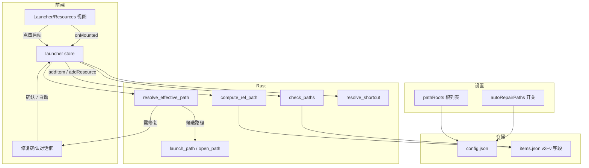

# 启动路径双写与回退修复 · 优化方案

> **状态：草稿 — 开发者确认前禁止实施。**

---

## 元信息

- **功能名称**：启动项/资源路径双写与失效回退修复
- **关联需求**：`docs/01_需求分析/20260917_启动路径双写与回退修复需求分析.md`
- **类型**：优化升级（功能增强 + 体验优化）
- **预估工作量**：1.5–2 人日
- **版本**：v0.1
- **状态**：已确认 · 已实施（自动化 8/8 通过；UI 手工回归见 `docs/05_回归用例/20260917_启动路径双写与回退.md`）
- **创建日期**：2026-09-17
- **作者**：AI

---

## 1. 方案概述

在启动项与资源上**冗余相对路径**（相对设置中的「路径根目录」），启动时按 **绝对 → rootHint+相对 → 各根+相对** 回退；相对可用而绝对失效时默认询问修复，并提供设置开关「自动修复路径」。列表加载时异步批量健康检查并展示状态。**只修主 `path`**；`.lnk` 的 `target`/`iconPath` 在修复成功后经 `resolve_shortcut` 重解析，不手工改写 `iconData`。

---

## 2. 整体架构



---

## 3. 数据设计（无数据库；JSON 演进）

### 3.1 `config.json` — `launcher` 扩展

```json
{
  "launcher": {
    "autoScan": true,
    "extraPaths": [],
    "pathRoots": ["D:\\Portable", "C:\\Users\\me\\Tools"],
    "autoRepairPaths": false
  }
}
```

| 字段 | 类型 | 默认 | 说明 |
|---|---|---|---|
| `pathRoots` | `string[]` | `[]` | 相对路径基准根，有序 |
| `autoRepairPaths` | `boolean` | `false` | true：相对解析成功后静默写回 `path`；false：询问 |

前端 `AppSettings.launcher` 同步扩展；`settings.ts` `DEFAULTS` 与 Rust `default_settings()` 对齐。合并旧配置时缺省字段自动补齐（已有 `Object.assign` + DEFAULTS 模式）。

### 3.2 `items.json` — `LauncherItem` / `ResourceItem` 扩展

| 字段 | 类型 | 默认 | 说明 |
|---|---|---|---|
| `relPath` | `string \| null` | `null` | 相对**某一根**的子路径，Windows 分隔符 `\`，不含前导 `\` |
| `rootHint` | `string \| null` | `null` | 计算 `relPath` 时使用的根（优先回退用） |

**版本策略**：保留 `version: 3`（可选字段，缺省当 null）。`migrate()` 对 v1/v2 升级时写入 `relPath: null, rootHint: null`。不在本期强制 bump v4，降低与备份需求的冲突面。

```ts
// types/index.ts
export interface LauncherItem {
  // ...existing
  relPath?: string | null
  rootHint?: string | null
}
export interface ResourceItem {
  // ...existing
  relPath?: string | null
  rootHint?: string | null
}
```

### 3.3 计算规则（`compute_rel_path`）

输入：`abs: string`, `roots: string[]`  
输出：`{ relPath, rootHint } | { relPath: null, rootHint: null }`

1. 规范化：去尾 `\`/`/`，Windows 下比较用小写。
2. 仅当 `abs` 以 `root + \` 为前缀（大小写不敏感）时视为在根下。
3. `relPath` = 去掉前缀后的相对部分；若结果含 `..` 或为空 → 返回 null。
4. 多个根同时匹配时取**最长根**（更具体）。
5. 网址、空路径 → null。

### 3.4 解析规则（`resolve_effective_path`）

输入：`path`, `relPath`, `rootHint`, `roots[]`  
输出：

```ts
type ResolveResult =
  | { status: 'ok'; path: string; usedRelative: false }
  | { status: 'ok'; path: string; usedRelative: true; suggestedAbs: string }
  | { status: 'missing' }
```

优先级：

1. `path` 非空且 `Path::new(path).exists()` → `ok`（绝对）。
2. 否则若有 `relPath`：
   - 先试 `rootHint`（若配置中仍存在该根或仅作拼接前缀）+ rel；
   - 再按 `pathRoots` 顺序试 `root + \ + rel`；
   - 第一个 `exists` 的 → `ok` + `usedRelative=true` + `suggestedAbs`。
3. 均失败 → `missing`。

> 拼接使用 `Path::join`，避免手写分隔符双斜线问题。

---

## 4. 接口设计（Tauri Commands）

### 4.1 `compute_rel_path`

- **入参**：`{ path: string, roots: string[] }`
- **出参**：`{ relPath: string | null, rootHint: string | null }`
- **错误**：无（失败返回 null 字段）

### 4.2 `resolve_effective_path`

- **入参**：`{ path: string, relPath?: string | null, rootHint?: string | null, roots: string[] }`
- **出参**：见 §3.4
- **错误**：参数非法时 `Err(String)`

### 4.3 `check_paths`

- **入参**：`{ items: Array<{ id: string, kind: 'launcher'|'file'|'folder'|'url', path: string, relPath?: string|null, rootHint?: string|null }>, roots: string[] }`
- **出参**：`Array<{ id, status: 'ok'|'recoverable'|'missing'|'skipped', resolved?: string }>`
  - `url` → `skipped`
  - 绝对可用 → `ok`
  - 相对可解析 → `recoverable` + `resolved`
  - 否则 → `missing`
- **实现注意**：Rust 内对 `items` 做最多 8 路并发 `exists`（或简单顺序 + 超大列表截断）；单次调用不做递归扫描。

### 4.4 既有命令

| 命令 | 变更 |
|---|---|
| `launch_path` / `open_path` | **不变**（入参仍是最终路径） |
| `resolve_shortcut` | **不变**；仅在 path 修复成功后由前端再调用以刷新 target/iconPath |
| `extract_icon` | **不变**；修复后不自动调用 |

---

## 5. 前端设计

### 5.1 `stores/settings.ts`

- `AppSettings.launcher` 增加两字段。
- 增加 `setPathRoots(roots)`、`setAutoRepairPaths(v)`（走既有 `patch` + `persist`）。

### 5.2 `stores/launcher.ts`

| 动作 | 行为 |
|---|---|
| `addItem` / `addItemsFromShortcuts` / `addResource` | 落盘前 `invoke('compute_rel_path')` 填 `relPath`/`rootHint` |
| `launchItem` | `resolve_effective_path` → `ok` 则 `launch_path`；`usedRelative` 时按设置修复或抛出待确认事件；`missing` 报错 |
| `openResource` | `kind=url` 保持 `open_url`；否则同上走 resolve + `open_path` |
| `repairItem(id)` | 将 `path=suggestedAbs`，并 `compute_rel_path` 刷新字段后 `persist`；`.lnk` 则 `resolve_shortcut` 更新 `target`/`iconPath` |
| `checkHealth()` | 调 `check_paths`，写入 `pathHealth: Record<id, PathHealth>`；`autoRepairPaths` 时对 `recoverable` 自动 `repairItem` |
| getter `pathHealth` | 供视图角标 |

状态字段：`pathHealth: Record<string, { status, resolved? }>`、`checkingPaths: boolean`。

### 5.3 视图

**LauncherView / ResourcesView**

- 卡片：`recoverable` 显示「可恢复」弱提示；`missing` 显示「路径失效」。
- 右键/按钮：`修复路径`（仅 recoverable）；既有「刷新图标」不变。
- `onMounted`：`load` 后 `void launcher.checkHealth()`（不 await 阻塞首屏）。

**启动时修复确认**

- 复用现有对话框风格（参考 EnvView 的 `confirmEmptyPath`）。
- 文案示例：  
  「绝对路径已失效，但相对路径可用。  
  是否将路径修复为：`E:\Portable\Apps\Foo\Foo.exe`？」
- 按钮：修复并启动 / 仅本次启动 / 取消。

**SettingsView** 新增「路径根目录」区块：

- 列表 + 添加（目录选择可走 `tauri-plugin-dialog` 若已有；否则文本框粘贴路径）+ 删除。
- 开关：自动修复路径。
- 按钮：对已有启动项/资源**回填相对路径**（对每条 `compute_rel_path` 后 `persist`）。
- 说明文案：解释回退顺序与「只修主路径、不改图标缓存」。

> 实施前确认：项目是否已依赖 `tauri-plugin-dialog`；若无则首版用文本输入，避免扩大依赖面。

### 5.4 迁移与回填

- 旧数据加载后 `relPath` 为空 → 不影响启动。
- 设置页「回填相对路径」：仅写入能匹配根的条目；不删除任何已有字段。

---

## 6. 兼容性分析

| 层面 | 策略 |
|---|---|
| 数据 | 新字段 optional；旧 `items.json`/`config.json` 直接可读；缺省补齐 |
| 接口 | 新增命令，不改旧命令签名；旧前端/后端混用风险低（同仓同版本发布） |
| 前端调用方 | `addItem`/`addResource`/`launchItem`/`openResource` 签名不变，内部扩展 |
| 图标 | 不自动重抽、不改 `iconData`；修复后仅重解析 lnk 元数据 |
| 网址资源 | 完全跳过 |

---

## 7. 回归风险与用例（写入方案末尾，同步拷贝 `docs/05_回归用例/`）

### 7.1 风险

| 风险 | 等级 | 缓解 |
|---|---|---|
| 相对路径误匹配错误软件 | 中 | rootHint 优先 + 确认框展示完整目标路径 |
| 批量 exists 卡 UI | 中 | Rust 侧执行 + 前端异步；大量条目时分块 invoke |
| 自动修复写错 path | 中 | 默认关闭；仅 `exists` 成功的 suggestedAbs 才写 |
| 老版本字段被 strip | 低 | serde 前端类型 optional；persist 全量写回含新字段 |

### 7.2 回归用例（摘要）

| 用例 | 步骤 | 期望 |
|---|---|---|
| G-01 无根旧行为 | 不配根，打开旧数据并启动 | 与改前一致 |
| G-02 根下新增 | 配根后拖入根下文件 | 落盘含 relPath/rootHint |
| G-03 非根新增 | 拖入根外路径 | relPath=null，可启动 |
| G-04 相对回退 | 改 path 为不存在，保留 relPath，配好根 | 启动成功；询问修复 |
| G-05 自动修复 | 开 autoRepairPaths 后重复 G-04 | path 被写为 resolved，无阻塞弹窗（或轻提示） |
| G-06 双失效 | path 与 rel 均无效 | 明确错误，不崩溃 |
| G-07 url | 网址资源加载/打开 | 无检测角标，打开正常 |
| G-08 lnk 图标 | .lnk path 修复 | target/iconPath 更新；iconData 不被错误覆盖 |
| G-09 回填 | 存量绝对路径在根下 | 一键回填后含 relPath |
| G-10 设置持久化 | 配置根与开关后重启 | 配置仍在 |

---

## 8. 实施步骤（确认后执行）

1. 类型与默认配置（TS + Rust `default_settings`）。
2. Rust：`compute_rel_path` / `resolve_effective_path` / `check_paths` + 单元测试（前缀匹配、多根最长匹配、`..` 拒绝、url skip）。
3. 前端 store：读写新字段、launch/open 回退、repair、checkHealth。
4. UI：设置区块、健康角标、修复确认框、回填按钮。
5. 手工回归 G-01–G-10。
6. 文档：用户手册、回归用例归档、`文档更新日志`。

---

## 9. 规范符合性

- 命名/风格：`docs/00_通用规范/01_命名与代码风格规范.md`
- 前端：`04_前端开发规范.md`；后端命令：`05_后端开发规范.md`
- 错误处理：路径解析失败返回结构化 status，不 panic；用户可见中文错误
- 安全：不执行拼接后的任意命令，仅 `exists` + 系统 `open_path`；根目录由用户配置，不做网络路径自动探测

---

## 10. 需要开发者拍板的点

1. **确认本方案**后进入开发。
2. 根目录是否允许 UNC？（默认允许）
3. 自动修复默认关闭？（默认是）
4. 添加路径时是否需要系统目录选择器？（若项目未接 dialog 插件，首版文本输入）
