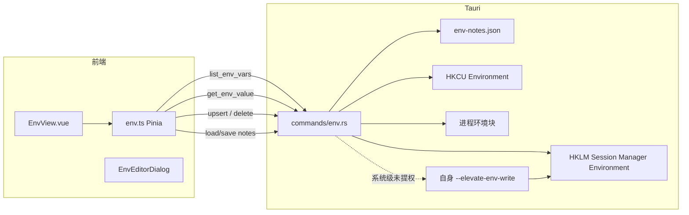

# 环境变量板块 · 实施方案

- **功能名称**：环境变量查看 / 备注 / 复制 / 增删改
- **关联需求**：`docs/01_需求分析/20260916_环境变量查看与编辑需求分析.md`
- **类型**：新功能
- **预估工作量**：0.5–1 天
- **版本**：v0.1
- **状态**：已实施
- **创建日期**：2026-09-16
- **作者**：AI

---

## 1. 方案概述

在凌台左侧导航增加「环境变量」页。Rust 端从 HKCU / HKLM 注册表和当前进程环境块读取变量；列表只把名称、范围、备注交给前端（值不下发列表接口）。复制 / 编辑时再按「名称 + 范围」单独取真实值。用户级直接写注册表并 `WM_SETTINGCHANGE`；系统级未提权时用 `runas` 再拉起本进程一次，走 `--elevate-env-write <json>` 完成写入后退出；进程级走 `SetEnvironmentVariableW`。备注单独存在 `%APPDATA%\com.loft.app\env-notes.json`。PATH 在编辑弹窗里拆成可排序条目。

---

## 2. 整体架构



---

## 3. 数据库设计

无数据库。持久化两个 JSON：

### 3.1 备注 `env-notes.json`

```json
{
  "version": 1,
  "notes": {
    "user:JAVA_HOME": "公司 JDK 17",
    "machine:Path": "系统 PATH，勿随意删"
  }
}
```

键：`{scope}:{name}`，scope ∈ `user` | `machine` | `process`。name 保持注册表原大小写。

### 3.2 提权载荷（临时文件，用完即删）

`%TEMP%\loft-env-elevate-<uuid>.json`

```json
{
  "op": "upsert",
  "scope": "machine",
  "name": "Path",
  "value": "C:\\Windows\\system32;..."
}
```

或 `{ "op": "delete", "scope": "machine", "name": "FOO" }`。

结果写到同目录 `*.result.json`：`{ "ok": true }` 或 `{ "ok": false, "error": "..." }`。

### 3.3 回滚

- 备注文件可直接删，不影响 Windows。
- 注册表写入无自动回滚；删除 / 覆盖前前端弹确认。紧急回滚靠用户在本页再改回去，或系统「环境变量」对话框。

---

## 4. 接口设计

均为 Tauri command，错误用 `Result<_, String>`，字符串面向用户。

### 4.1 `list_env_vars`

- 入参：`scopes: string[]`（`user` / `machine` / `process`，可多选）
- 出参：`EnvVarRow[]`，**不含 value**

```json
{
  "name": "JAVA_HOME",
  "scope": "user",
  "kind": "sz"
}
```

`kind`：`sz` | `expand_sz` | `process`。

### 4.2 `get_env_value`

- 入参：`name`, `scope`
- 出参：`string`（原值，未展开）
- 错误：不存在 → `变量不存在: {name}`

### 4.3 `upsert_env_var`

- 入参：`name`, `scope`, `value`
- 出参：`()`
- 错误：名称非法 / UAC 取消 / 拒绝访问 / 写入失败
- 系统级未提权：内部走 elevate，前端只看到最终成功或「已取消提权」

### 4.4 `delete_env_var`

- 入参：`name`, `scope`
- 出参：`()`
- 不存在视为成功（幂等）

### 4.5 `load_env_notes` / `save_env_notes`

与现有 `load_items` 同模式，读写 `env-notes.json`。

### 4.6 权限

单机本地，无 RBAC。系统级依赖 Windows UAC。

---

## 5. 后端实现

### 5.1 涉及模块

- 新增 `src-tauri/src/commands/env.rs`
- `commands/mod.rs` 导出；`lib.rs` 注册 6 个 command
- `lib.rs` `run()` 之前：若 `std::env::args` 含 `--elevate-env-write`，走 helper 分支后 `process::exit`，不启动 GUI
- `Cargo.toml` windows features 增加：
  - `Win32_System_Registry`
  - `Win32_System_Threading`（可选，检测 token 是否 elevated）
  - `Win32_Security`（TokenElevation）
  - `Win32_UI_WindowsAndMessaging`（SendMessageTimeoutW, HWND_BROADCAST, WM_SETTINGCHANGE）
  - `Win32_System_Environment`（SetEnvironmentVariableW）
  - 已有 `Win32_UI_Shell`（ShellExecuteExW）

### 5.2 关键函数

```
list_env_vars(scopes) → Vec<EnvVarRow>
get_env_value(name, scope) → String
upsert_env_var(name, scope, value)
delete_env_var(name, scope)
load_env_notes / save_env_notes

read_registry_env(hkey, subkey) → Vec<(name, value, kind)>
write_registry_env(...)
delete_registry_env(...)
broadcast_environment()
is_process_elevated() → bool
elevate_and_wait(payload_path) → Result
run_elevate_helper()   // main 入口短路
```

注册表路径：

- user：`HKEY_CURRENT_USER\Environment`
- machine：`HKEY_LOCAL_MACHINE\SYSTEM\CurrentControlSet\Control\Session Manager\Environment`

读取用 `RegOpenKeyExW` + `RegEnumValueW`；写入 `RegSetValueExW`（含 `%` 则 REG_EXPAND_SZ 否则 REG_SZ）；删除 `RegDeleteValueW`。

进程列表：`std::env::vars_os()`，过滤掉名字非法的项。

进程写入：`SetEnvironmentVariableW`；删除传 `None`。注意 Rust `std::env::set_var` 在新版本是 unsafe，统一走 Win32。

提权：

1. 检测 `TokenElevation`
2. 未提权：把 payload 写 temp，`ShellExecuteExW` `lpVerb=runas`，`lpFile=当前 exe`，`lpParameters=--elevate-env-write "<payload>"`，`SEE_MASK_NOCLOSEPROCESS`，等进程结束，读 result json
3. 已提权：直接写 HKLM
4. `ShellExecuteEx` 返回 `ERROR_CANCELLED`（1223）→ `"已取消提权"`

`broadcast_environment`：`SendMessageTimeoutW(HWND_BROADCAST, WM_SETTINGCHANGE, 0, LPARAM("Environment"), SMTO_ABORTIFHUNG, 5000, …)`。失败只 warn，不让整次 upsert 失败（与系统对话框行为一致）。

名称校验：空、含 `=`、含 `\0`、长度 > 255 → 拒绝。

### 5.3 事务与并发

单机单用户。备注保存无锁，后写覆盖。提权 helper 与主进程串行等待。不做文件锁。

### 5.4 外部依赖

仅 Windows API。不新增 crate（`windows` 已有）。

非 Windows：`list_env_vars` 对 user/machine 返回空并在错误里带「仅 Windows 支持用户/系统环境变量」仅当用户只选了这两档且结果为空时由前端提示；命令本身对 process 档用 `std::env::vars_os`。upsert/delete 的 user/machine 直接 `Err("当前系统不支持修改用户/系统环境变量")`。

---

## 6. 前端实现

### 6.1 页面结构

- 路由 `/env`，`meta.title = '环境变量'`，`icon = i-carbon-ibm-cloud-vpc-block-storage-snapshots` 或 `i-carbon-data-set`（Carbon 里更贴切的是 `i-carbon-tree-view-alt` / `i-carbon-list`）。选用 **`i-carbon-data-base`**，与「环境」弱相关但侧栏已有 grid/folder/chart/network/settings，用 **`i-carbon-code`** 也不准。最终：**`i-carbon-parameter`**（若 iconify carbon 无此名则降为 `i-carbon-list-checked`）。实现时以 `@iconify-json/carbon` 实际导出为准，优先 `i-carbon-data-set`。
- 侧栏自动从 router 生成，无需改 Sidebar.vue。
- 顺序：启动器 / 资源 / 性能 / 端口 / **环境变量** / 设置。

### 6.2 组件 / 状态

- 新增 `src/views/EnvView.vue`
- 新增 `src/stores/env.ts`
- 新增 `src/components/EnvEditorDialog.vue`（含 PATH 条目编辑）
- 复用 `PageHeader`、`ContextMenu`、Ports 同款确认 modal
- 类型放 `src/types/index.ts`：`EnvScope`、`EnvVarRow`

Store 状态：`rows`, `notes`, `loading`, `error`, `keyword`, `scopes: EnvScope[]`（默认 `['user','machine']`），`copiedName`（短暂反馈）。

值不进 store 的 rows。复制时 `invoke('get_env_value')` 再 `navigator.clipboard.writeText`。编辑弹窗打开时再取一次值。

备注：`notes` 为 `Record<string, string>`。input `@change` / blur debounce 400ms 调 `save_env_notes`。

### 6.3 关键交互

- 三档 chip 至少保持一档勾选；点掉最后一档时忽略。
- 新增：弹窗默认范围 = 当前勾选里优先级 用户 > 系统 > 进程。
- PATH 检测：`name.toLowerCase() === 'path'` 时编辑器切条目模式：每行一个 path，按钮 上移 / 下移 / 删除 / 添加。
- 删除关键名：`CRITICAL_NAMES` 二次确认文案含「可能导致新开的终端或程序找不到命令」。
- 提交防重：保存中 disable 按钮。

### 6.4 四态

- 加载：表体「正在读取环境变量…」
- 空：无匹配 / 过滤过空
- 错误：顶栏错误条 + 重试
- 权限：UAC 取消走错误条，不是独立权限页

---

## 7. 兼容性与影响分析

### 7.1 兼容性

- 老用户无 `env-notes.json`：按空对象创建。
- 不改 `config.json` / `items.json` schema。
- 启动器拉起外部程序仍走系统 shell，**不会**带上凌台进程档里临时加的变量。

### 7.2 调用方

- 新文件为主；改 `router/index.ts`、`types/index.ts`、`commands/mod.rs`、`lib.rs`、`Cargo.toml`。
- Sidebar 无硬编码，不改。

### 7.3 回归风险

- `lib.rs` 入口增加 args 短路：若解析错误可能让正常启动也 exit → helper 仅当 **第一个参数精确等于** `--elevate-env-write` 才进入，其它情况忽略。
- `windows` features 增加可能拉长编译，不改现有 API 用法。
- 侧栏六项在 mini 窗可能挤：文案「环境」两字可接受，title 仍用「环境变量」。若 mini 已落地，需肉眼看侧栏是否溢出。

### 7.4 回滚

- 发版后出问题：git revert 这批文件即可，注册表不会自动还原。文档提示用户备份后再改系统 Path。

---

## 8. 安全设计

- 列表不下发 value，降低肩窥 / 截图泄露。复制仍是明文，这是用户主动操作。
- 备注文件可能被用户自己写成密钥提示，仍只存本机。
- 提权 helper **只接受本机 temp 下的 json**，校验：
  - 路径必须是绝对路径且位于 `%TEMP%`
  - JSON 只允许 `op/scope/name/value` 四个字段
  - `scope` 必须是 `machine`（提权通道禁止拿来改 HKCU，减少被滥用面）
  - `op` ∈ upsert | delete
- 不把变量值写进普通日志。错误信息可含变量 **名**，不含 **值**。
- 前端名称校验与后端双校验。

---

## 9. 可观测性

- 提权 helper 启动 / 结束用现有 `diag::log_step`（只记 op + name + scope，不记 value）
- 主进程：UAC 取消 WARN；写入失败 ERROR（无值）
- 无新监控指标

---

## 10. 风险与降级

| 风险 | 影响 | 应对 |
|---|---|---|
| UAC 弹窗被安全软件拦截 | 系统级无法写 | 提示「请以管理员身份打开凌台后再试」 |
| `WM_SETTINGCHANGE` 部分程序不理 | 用户以为没生效 | 副标题写清「已打开的终端通常要重开」 |
| 用户清空系统 Path | 系统命令找不到 | 关键名 + 空 Path 双重确认 |
| 提权进程与主进程文件编码 | 中文路径失败 | 全部 UTF-8 json + wide Win32 API |
| `RegEnumValue` 缓冲区不足 | 漏变量 | 按返回长度扩容重试 |
| 剪贴板权限 | 复制失败 | 提示，不崩溃 |

---

## 11. 测试用例

| 编号 | 关联需求 | 前置条件 | 操作步骤 | 预期结果 | 优先级 |
|---|---|---|---|---|---|
| TC-ENV-001 | F-01 | 应用已开 | 点侧栏「环境变量」 | 进入列表页 | P0 |
| TC-ENV-002 | F-02 | — | 观察默认 chip | 用户、系统勾选，进程未勾 | P0 |
| TC-ENV-003 | F-03 | 用户级有 JAVA_HOME | 看该行 | 无任何单元格含路径值 | P0 |
| TC-ENV-004 | F-06 | 同上 | 点复制，去记事本粘贴 | 与注册表原值一致 | P0 |
| TC-ENV-005 | F-05 | — | 写备注，重启凌台 | 备注仍在 | P0 |
| TC-ENV-006 | F-07 | — | 新增用户 LOFT_TEST=hello | 系统属性可见；删除后消失 | P0 |
| TC-ENV-007 | F-08 | 未提权 | 改系统级，UAC 点取消 | 变量不变，提示已取消提权 | P0 |
| TC-ENV-008 | F-08 | 未提权 | 改系统级，UAC 同意 | 写入成功，列表刷新 | P0 |
| TC-ENV-009 | F-10 | — | 编辑用户 Path，加一条再保存 | 注册表 Path 含该段 | P0 |
| TC-ENV-010 | F-09 | — | 进程档新增 LOFT_PROC=1，重启凌台 | 重启后该变量不在 | P1 |
| TC-ENV-011 | F-13 | — | 删除 Path，点取消 | Path 仍在 | P0 |
| TC-ENV-012 | F-04 | 备注含「代理」 | 搜「代理」 | 仅备注匹配行留下 | P1 |
| TC-ENV-013 | F-12 | 模拟读取失败 | — | 错误条 + 重试 | P1 |
| TC-ENV-014 | F-07 | 已有 LOFT_TEST | 再新增同名 | 确认覆盖后值被替换 | P1 |
| TC-ENV-015 | 规则 | 值含 `%SystemRoot%` | 复制 | 粘贴的是未展开字符串 | P1 |

手工为主（单机 Win32）。PATH 拆分 / 名称校验可在 `env.rs` 抽纯函数做单元测试（若时间不够，手工覆盖 P0 即可）。

---

## 12. 实施计划

| 步骤 | 内容 | 预计时长 | 依赖 |
|---|---|---|---|
| 1 | Rust `env.rs` 读写注册表 + 进程 + 广播 | 2h | — |
| 2 | 提权 helper 入口 + 校验 | 1h | 1 |
| 3 | 备注 JSON + 注册 commands | 0.5h | 1 |
| 4 | 前端 store + EnvView 列表 / 复制 / 备注 | 1.5h | 3 |
| 5 | 编辑弹窗 + PATH 条目 + 删除确认 | 1.5h | 4 |
| 6 | 自测 P0 用例 + 文档归档 | 1h | 5 |

---

## 13. 待确认事项（请开发者拍板）

方案按以下默认实施，反对请指出：

1. 复制 **未展开** 原值
2. 改用户/系统 **不** 同步凌台进程环境块
3. 备注键 `{scope}:{name}`，同名不同范围互相独立
4. 关键名二次确认名单见需求文档 §13
5. 提权通道只允许改 `machine`，防止被拿来改别的
6. 侧栏文案「环境变量」，图标 `i-carbon-data-set`（若缺失则 `i-carbon-list-checked`）
7. 不动启动器继承环境

---

## 14. 评审记录

| 日期 | 评审人 | 意见 | 处理结果 |
|---|---|---|---|
| | | 待开发者确认 | |

---

## 15. 实施结果（开发完成后填写）

- 实际工作量：约半日（含方案确认）
- 偏差与原因：Mini 顶栏换行、同名覆盖后再走空 Path 确认，为落地时补的交互
- 测试结论：`cargo test --lib commands::env` 3 项通过；`vue-tsc --noEmit` 通过。P0 手工用例需在本机点一遍（含 UAC）
- 回归结论：侧栏/MiniNav 从路由生成，启动器与资源未改 JSON schema
