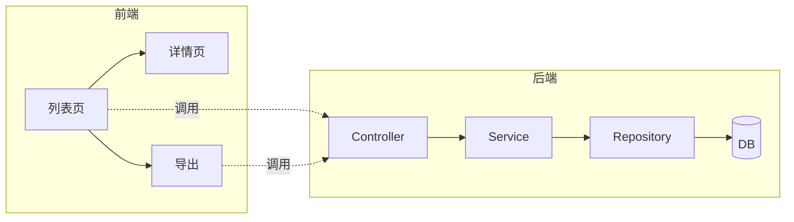

# 实施方案设计模板

> 复制为 `docs/02_功能设计/xx功能_实施方案_yyyymmdd.md` 后填空。
> 优化升级类任务额外加入「现状分析」「兼容性分析」「回归风险」三节（见 §3.5 / §6 / §7）。
> **方案未确认前禁止开始开发。**

---

## 元信息

- **功能名称**：xxx
- **关联需求**：`docs/01_需求分析/xxx.md`
- **类型**：新功能 / 优化升级 / 重构
- **预估工作量**：xxx
- **版本**：v0.1
- **状态**：草稿 / 评审中 / 已确认 / 已实施
- **创建日期**：yyyy-mm-dd
- **作者**：AI / 开发者

---

## 1. 方案概述

一段话总结：**这个方案做什么、怎么做、为什么这么做**。

---

## 2. 整体架构

> 用 Mermaid 画出本方案涉及的主要模块、数据流、调用关系。



---

## 3. 数据库设计

### 3.1 新增表
```sql
CREATE TABLE xxx (
  id BIGINT PRIMARY KEY,
  name VARCHAR(255) NOT NULL,
  status VARCHAR(32) NOT NULL DEFAULT 'draft',
  is_deleted BOOLEAN NOT NULL DEFAULT FALSE,
  created_at TIMESTAMP NOT NULL DEFAULT CURRENT_TIMESTAMP,
  updated_at TIMESTAMP NOT NULL DEFAULT CURRENT_TIMESTAMP,
  created_by BIGINT,
  updated_by BIGINT
);

CREATE INDEX idx_xxx_status ON xxx(status);
CREATE UNIQUE INDEX uk_xxx_name ON xxx(name);
```

### 3.2 修改已有表
- 表 `yyy` 增加字段：`new_field VARCHAR(100)`，默认值 xxx
- 表 `zzz` 增加索引：`idx_zzz_xxx_yyy(xxx, yyy)`

### 3.3 迁移脚本
- 文件：`V20260513001__xxx.sql`
- 含数据回填的，要写**幂等的 UPDATE**

### 3.4 回滚策略
- 本次迁移如何回滚（DROP / 重命名归档）
- 不能回滚的字段加入时要标注

### 3.5 现状分析（仅优化升级类填写）
- 现有表结构与字段含义
- 现有查询模式
- 现有索引覆盖情况
- 数据量级

---

## 4. 接口设计

> 每个接口列出：路径、方法、入参、出参、错误码、权限。

### 4.1 接口 1：xxx
- **路径**：`POST /api/v1/xxx`
- **权限**：`xxx:create` + 数据权限（自己的）
- **入参**：
  ```json
  {
    "name": "string, required, 1-100",
    "status": "string, optional, enum[draft,submitted]"
  }
  ```
- **出参（200/201）**：
  ```json
  {
    "id": "string",
    "name": "string",
    ...
  }
  ```
- **错误码**：
  - `400 INVALID_PARAM`：参数校验失败
  - `409 NAME_DUPLICATED`：名称重复
  - `403 FORBIDDEN`：无权限
- **幂等**：通过 `Idempotency-Key` Header 支持

### 4.2 接口 2、3、...
（按上面格式补充）

---

## 5. 后端实现

### 5.1 涉及模块/服务
- 模块 A：负责 xxx
- 模块 B：负责 yyy

### 5.2 关键类与方法（不写完整代码，写设计意图）
```
XxxController.createXxx(CreateXxxRequest) → XxxResponse
XxxService.create(CreateXxxCommand) → Xxx
XxxRepository.save(Xxx) → Xxx
XxxRepository.findActiveByName(name) → Optional<Xxx>
```

### 5.3 关键算法 / 业务规则
- 规则 1：xxx 的具体计算 / 状态流转
- 规则 2：xxx

### 5.4 事务与并发
- 事务边界：xxx
- 并发控制：乐观锁 / 唯一索引 / 分布式锁

### 5.5 外部依赖
- 调用 xxx 服务：超时、重试、降级
- 写消息队列：topic / 幂等键

---

## 6. 前端实现

### 6.1 页面结构
- 列表页：`/xxx`，主要交互 xxx
- 详情页：`/xxx/:id`
- 表单页：`/xxx/new`、`/xxx/:id/edit`

### 6.2 组件 / 状态
- 复用组件：xxx
- 新增组件：xxx
- 状态管理：本地 state / Pinia store / Query
- 路由守卫：权限校验

### 6.3 关键交互
- 表单校验规则
- 提交防重
- 列表分页 / 搜索 / 排序
- 导出走后端

### 6.4 四态处理
- 加载态：xxx
- 空态：xxx
- 错误态：xxx
- 权限态：xxx

---

## 7. 兼容性与影响分析（优化升级 + 必填）

### 7.1 兼容性
- 数据兼容：老数据如何处理？
- 接口兼容：是否破坏现有调用方？
- 前端兼容：是否影响其他页面用法？

### 7.2 调用方清单（grep 出来）
- 文件 A：调用 xxx 的位置
- 文件 B：调用 xxx 的位置
- 文件 C：...

### 7.3 回归风险
- 风险点 1：xxx，缓解措施：xxx
- 风险点 2：xxx，缓解措施：xxx

### 7.4 回滚方案
- 紧急回滚步骤：xxx
- 数据回滚（如有）：xxx

---

## 8. 安全设计

- 鉴权方式：xxx
- 权限点：xxx:create、xxx:update、xxx:delete、xxx:export
- 数据权限：SQL 层加 `WHERE owner_id = ?`
- 敏感数据：xxx 字段在响应中脱敏
- 输入校验：后端 DTO 校验 + Service 二次校验
- 详见 `docs/00_通用规范/06_安全规范.md`

---

## 9. 可观测性

- 关键日志：
  - INFO：xxx 创建成功 (id, user_id)
  - WARN：xxx 重复请求被拒
  - ERROR：xxx 操作失败
- 监控指标：接口耗时、错误率、xxx 业务计数
- 审计日志：xxx 关键操作记录到审计表

---

## 10. 风险与降级

| 风险 | 影响 | 应对 |
|---|---|---|
| 风险 1 | 描述 | 应对 |
| 风险 2 | 描述 | 应对 |

---

## 11. 测试用例（在此处列出，详见 104 工作流）

| 编号 | 关联需求 | 前置条件 | 操作步骤 | 预期结果 | 优先级 |
|---|---|---|---|---|---|
| TC-XXX-001 | F-01 | 用户已登录 | 1. 进入列表 2. 点新建 3. 填表提交 | 创建成功且列表有数据 | P0 |
| TC-XXX-002 | F-01 | 同上 | 提交空表单 | 各字段红色提示 | P1 |
| ... | | | | | |

---

## 12. 实施计划

| 步骤 | 内容 | 预计时长 | 依赖 |
|---|---|---|---|
| 1 | 数据库迁移 | x 小时 | - |
| 2 | 后端接口 | x 小时 | 1 |
| 3 | 前端页面 | x 小时 | 2 |
| 4 | 联调 + 自测 | x 小时 | 1-3 |
| 5 | 测试 + 审查 | x 小时 | 4 |

---

## 13. 待确认事项

- [ ] 待确认 1：xxx
- [ ] 待确认 2：xxx

---

## 14. 评审记录

| 日期 | 评审人 | 意见 | 处理结果 |
|---|---|---|---|
| yyyy-mm-dd | 开发者 | xxx | 已采纳 |

---

## 15. 实施结果（开发完成后填写）

- 实际工作量：xxx
- 偏差与原因：xxx
- before/after 指标（优化类）：xxx
- 测试结论：通过 / 待修复
- 回归结论：xxx
