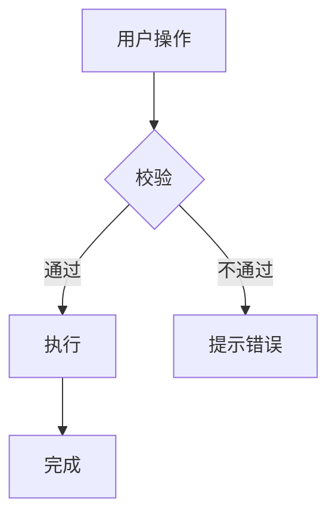
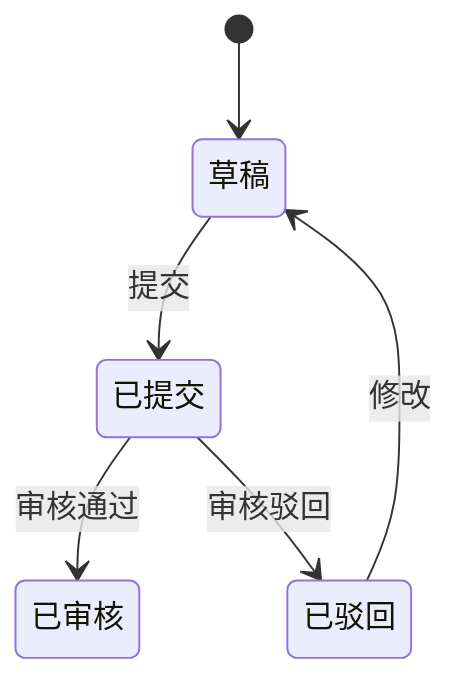

# 需求分析模板

> 复制为 `docs/01_需求分析/yyyymmdd_xxx需求分析.md` 后填空。
> 凡是「待确认」的项目必须在写出方案前由开发者/产品确认。

---

## 元信息

- **需求名称**：xxx
- **需求来源**：（开发者 / 产品经理 / 业务方）
- **关联 PRD / UI**：（路径或链接，无则填"无"）
- **优先级**：P0 / P1 / P2 / P3
- **状态**：草稿 / 已冻结 / 已开发 / 已上线
- **版本**：v0.1
- **创建日期**：yyyy-mm-dd
- **最后更新**：yyyy-mm-dd

---

## 1. 业务背景

> 一段话回答：**为什么要做这个？** 不要"老板说要做"。

- 当前业务现状
- 当前面临的问题
- 不做会怎样
- 做了之后的预期收益

---

## 2. 目标与非目标

### 目标
- 必达目标 1
- 必达目标 2
- 可量化指标（如"列表查询从 5s 降到 < 1s"、"用户每周创建订单数提升 X%"）

### 非目标（**重要：明确不做什么避免范围蔓延**）
- 本次不做 xxx
- 本次不优化 yyy
- 本次不解决 zzz

---

## 3. 用户与场景

### 用户角色
| 角色 | 描述 | 权限 |
|---|---|---|
| 角色 A | xxx | 可创建、可编辑 |
| 角色 B | xxx | 仅查看 |
| 管理员 | xxx | 全部操作 + 配置 |

### 核心使用场景
1. **场景 1：xxx**
   - 触发：用户做了什么
   - 流程：步骤 1 → 步骤 2 → 步骤 3
   - 结果：用户得到什么
2. **场景 2：xxx**
   - ...

---

## 4. 业务流程

> 用 Mermaid 画出核心流程。包括正常路径和异常路径。

---

## 5. 数据模型（业务视角，非数据库设计）

| 实体 | 关键属性 | 关系 |
|---|---|---|
| 实体 A | id, name, status, ... | 多对一 实体 B |
| 实体 B | id, ... | 一对多 实体 A |

> 状态机请用 Mermaid 画出：

---

## 6. 功能清单

| 编号 | 功能 | 必做 / 可选 | 备注 |
|---|---|---|---|
| F-01 | xxx | 必做 | |
| F-02 | xxx | 必做 | |
| F-03 | xxx | 可选 | |

---

## 7. 业务规则

### 7.1 校验规则
- 字段 A：必填、长度 1-50、格式 xxx
- 字段 B：可选、数值范围 0-100
- 唯一性：xxx 在 yyy 范围内不能重复

### 7.2 计算规则
- 公式：xxx
- 边界：xxx 时按 yyy 处理

### 7.3 权限规则
- 角色 A 只能看自己创建的
- 角色 B 可以看本部门的
- 管理员可看全部

### 7.4 状态流转规则
| 当前状态 | 触发事件 | 目标状态 | 谁可操作 |
|---|---|---|---|
| 草稿 | 提交 | 已提交 | 创建者 |
| 已提交 | 审核 | 已审核 / 已驳回 | 审核员 |

---

## 8. 验收标准

> **每条验收标准必须可被转写为测试步骤**，禁止"流畅、友好"这类模糊词。

- [ ] 用户能从菜单 X 进入页面 Y
- [ ] 填写有效数据点击提交，后端写入数据库，列表中能看到
- [ ] 填写无效数据点击提交，前端给字段级错误提示，无数据写入
- [ ] 无权限用户访问 → 跳 403
- [ ] 接口响应 P95 < 500ms（指标类目标）

---

## 9. 边界条件 / 异常路径

> 列出所有需要处理的"非主路径"，**这部分常被忽略**。

| 场景 | 行为 |
|---|---|
| 空列表 | 显示空态 + 引导操作 |
| 加载失败 | 显示错误态 + 重试按钮 |
| 网络超时 | 提示用户网络问题，按钮恢复可点 |
| 并发提交 | 第二次提交告知"已有人操作" |
| 超长输入（如 10000 字符） | 前后端均限制，超出截断 + 提示 |
| 无权限 | 隐藏入口 + 后端 403 双保险 |

---

## 10. 关联影响

### 受影响的现有功能
- xxx 模块：影响 xxx，需回归
- yyy 报表：字段口径变化

### 依赖的现有功能
- 用户中心：登录、角色
- 字典服务：xxx 字典需新增 yyy

### 配置变更
- 是否新增字典 → 更新 `docs/11_字典/系统字典.md`
- 是否新增菜单 → 用户手册"管理员配置"小节
- 是否新增权限点 → 用户手册"管理员配置"小节

---

## 11. UI / 交互（如有 PRD 则引用，否则简述）

- 主要页面：列表页 / 详情页 / 表单页
- 关键交互：xxx
- 设计稿：链接 / 文件路径

---

## 12. 测试视角评审记录

> 按 `104_测试工作流程.md` §3 做可测性体检。

- [ ] 验收用例可直接转为测试步骤
- [ ] 边界条件明确
- [ ] 异常路径覆盖
- [ ] 可观测性就绪
- [ ] 可回放性具备

发现的问题：
- 问题 1：xxx
- 问题 2：xxx

---

## 13. 待确认事项

> 列出所有需要开发者/产品/业务方确认的点。**这些不确认前不能写方案。**

- [ ] 待确认 1：xxx？（候选 A / B / C，倾向 A，请确认）
- [ ] 待确认 2：xxx？

---

## 14. 变更记录

| 日期 | 版本 | 变更内容 | 操作人 |
|---|---|---|---|
| yyyy-mm-dd | v0.1 | 初稿 | AI |
| yyyy-mm-dd | v1.0 | 冻结 | 产品 |
